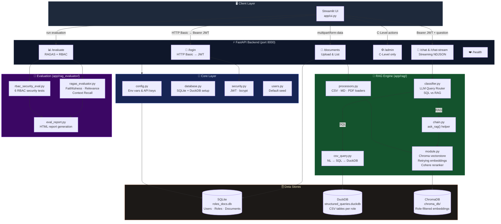
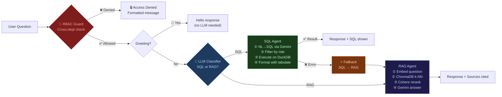
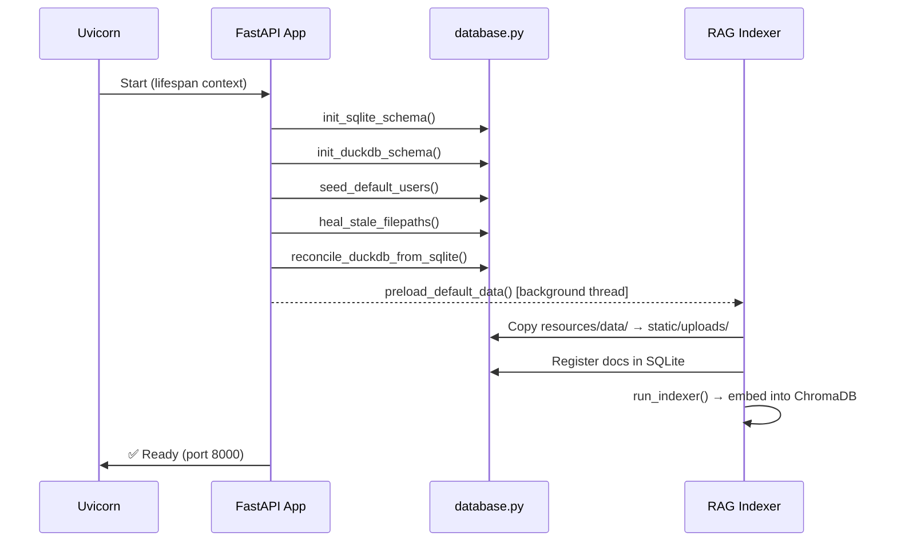

<div align="center">

# 🔍 FinSight

### Enterprise AI Workspace with Role-Based Access Control

*Intelligent document Q&A · SQL analytics · Multi-department security · RAG evaluation*

[](https://python.org)
[](https://fastapi.tiangolo.com)
[](https://streamlit.io)
[](https://langchain.com)
[](https://deepmind.google/technologies/gemini/)
[](https://trychroma.com)
[](https://duckdb.org)
[](LICENSE)

</div>

---

## 📋 Table of Contents

- [Overview](#-overview)
- [Business Problem](#-business-problem)
- [System Architecture](#-system-architecture)
- [Request Lifecycle](#-request-lifecycle)
- [Key Features](#-key-features)
- [Tech Stack](#-tech-stack)
- [Project Structure](#-project-structure)
- [Database Schema](#-database-schema)
- [API Reference](#-api-reference)
- [Role & Permission Matrix](#-role--permission-matrix)
- [Quick Start](#-quick-start)
- [Configuration](#-configuration)
- [Default Credentials](#-default-credentials)
- [Testing](#-testing)
- [Evaluation Framework](#-evaluation-framework)
- [Sample Queries](#-sample-queries)

---

## 🧠 Overview

**FinSight** is a production-grade, role-based AI workspace built for enterprise environments. It combines **Retrieval-Augmented Generation (RAG)** for unstructured document Q&A with a **Natural Language → SQL** engine for structured CSV analytics — all behind a strict **JWT-authenticated, department-scoped access control layer**.

Users query their department's data in plain English. FinSight automatically classifies each question, routes it to the correct engine (RAG or SQL), and returns a grounded, source-cited response — while silently blocking any attempt to access another department's data.

> **Stack in one line:** Streamlit UI → FastAPI → Gemini LLM + LangChain → ChromaDB (RAG) / DuckDB (SQL) → RAGAS evaluation

---

## 💼 Business Problem

FinSolve Technologies faced three interconnected challenges:

| Problem | Impact |
|---|---|
| **Siloed departmental data** — Finance, HR, Marketing, and Engineering each hoarded their own documents with no unified interface | Slow decision-making; leadership had no consolidated view |
| **Manual information retrieval** — analysts spent hours reading reports to find single data points | Productivity loss across all departments |
| **No access governance** — sensitive payroll, financial, and engineering IP were accessible to any authenticated employee | Data confidentiality and compliance risk |

FinSight solves all three: a single AI interface that delivers the right answer to the right person, and nothing more.

---

## 🏗 System Architecture

### High-Level Architecture



---

### Query Routing Flow



---

### Startup Lifecycle



---

## 🔄 Request Lifecycle

A complete chat request from browser to response:

```
Browser ──► Streamlit (8501) ──► POST /chat-stream (8000)
                                        │
                                   [Bearer JWT validated]
                                        │
                              ┌─────────▼──────────┐
                              │  RBAC Guard         │ ← Cross-dept keyword scan
                              └─────────┬──────────┘
                                        │
                              ┌─────────▼──────────┐
                              │  Query Classifier   │ ← Gemini LLM: "SQL" | "RAG"
                              └──────┬──────┬───────┘
                                  SQL│      │RAG
                         ┌──────────▼┐    ┌▼──────────────┐
                         │ NL→SQL    │    │ Embed question │
                         │ (Gemini)  │    │ (text-embed-4) │
                         └──────┬────┘    └──────┬─────────┘
                                │                │
                         ┌──────▼────┐    ┌──────▼─────────┐
                         │ DuckDB    │    │ ChromaDB k=8   │
                         │ (role-    │    │ (role-filtered)│
                         │  filtered)│    └──────┬─────────┘
                         └──────┬────┘           │
                                │         ┌──────▼─────────┐
                                │         │ Cohere Rerank  │ (optional)
                                │         └──────┬─────────┘
                                │                │
                                │         ┌──────▼─────────┐
                                │         │ Gemini Answer  │
                                │         └──────┬─────────┘
                                │                │
                         ┌──────▼────────────────▼──┐
                         │   NDJSON stream → Browser  │
                         └───────────────────────────┘
```

---

## ✨ Key Features

### 🔐 1. Role-Based Access Control (RBAC)

- **JWT authentication** (HS256, 12-hour expiry) issued at `/login` via HTTP Basic
- **Department isolation**: every document is tagged with a role; ChromaDB filters embeddings at query time using metadata
- **Cross-department guard**: a phrase-pattern scanner blocks `HR` users from querying Finance data, etc., *before* any LLM call
- **C-Level override**: the `c-level` role bypasses all department restrictions

### 🤖 2. Intelligent Dual-Mode Query Routing

| Mode | Trigger | Engine | Example |
|------|---------|--------|---------|
| **RAG** | "summarize", "explain", policy questions | Chroma + Gemini | *"Summarize the HR onboarding policy"* |
| **SQL** | "show", "list", "count", numeric filters | DuckDB + Gemini | *"List employees with salary > 80,000"* |
| **Greeting** | greetings, small-talk | Inline response | *"Hello!"* |
| **Fallback** | SQL fails / empty result | SQL → RAG | Automatic, transparent |

The **LLM classifier** (`app/rag/classifier.py`) uses a zero-shot Gemini prompt with hand-crafted disambiguation rules to achieve high routing accuracy without a fine-tuned model.

### ⚡ 3. Streaming Responses

`POST /chat-stream` returns **NDJSON** chunks in real time so the Streamlit UI can progressively render the answer — no waiting for the full response:

```json
{"type": "init",     "user": "alice", "role": "Finance", "mode": "RAG"}
{"type": "token",    "content": "The gross margin for 2024..."}
{"type": "token",    "content": " was 42.3%, an increase..."}
{"type": "metadata", "sources": ["finance_report_2024.md"], "fallback": false}
```

### 🗄️ 4. Dual Database Architecture

| Database | Technology | Purpose |
|----------|-----------|---------|
| **Metadata store** | SQLite (WAL mode) | Users, roles, document registry, chunk counters |
| **Structured queries** | DuckDB (in-process) | One table per uploaded CSV, role-scoped |
| **Vector store** | ChromaDB | Embeddings for unstructured doc retrieval |

DuckDB tables are auto-created on CSV upload and reconciled from SQLite on every startup (`reconcile_duckdb_from_sqlite`). A `heal_stale_filepaths()` routine corrects absolute paths when the project folder is renamed or moved.

### 📊 5. Document Processing Pipeline

Supports three file types with dedicated loading strategies (Strategy pattern):

| File Type | Loader | Chunking Strategy |
|-----------|--------|-------------------|
| `.csv` | `CSVDocumentLoader` | Single document (full CSV as text) |
| `.md` | `MarkdownDocumentLoader` | `RecursiveCharacterTextSplitter` |
| `.pdf` | `PDFDocumentLoader` (pdfplumber) | Page-level + text splitter |

All chunks are tagged with `role`, `source`, and `filepath` metadata for retrieval filtering.

### 🔁 6. Production-Grade Embedding with Smart Retry

`RetryingEmbeddings` wraps `GoogleGenerativeAIEmbeddings` with:
- **Transient 429** → reads `retry_delay` from the error proto, waits, retries up to 10×
- **Hard quota** → raises immediately; the failing document is marked `embedded=-1` in SQLite
- **Exponential back-off** capped at 120s

### 🏆 7. Cohere Reranker

When `COHERE_API_KEY` is set, the RAG pipeline upgrades from a simple top-8 vector search to a two-stage retrieve-then-rerank approach, dramatically reducing irrelevant context passed to the LLM.

### 🛡️ 8. Comprehensive Evaluation Suite

Two independent evaluation tracks run via `POST /evaluate` (C-Level only):

**Quality Evaluation (RAGAS)**
- Faithfulness, Answer Relevancy, Context Recall, Context Precision
- Synthetic QA pairs generated per role from live documents
- Results persisted as CSV + HTML report

**RBAC Security Evaluation**
Six automated tests verify the access control layer:

| Test | What it checks |
|------|---------------|
| `test_unauthorized_access_blocked` | Role A cannot retrieve Role B documents |
| `test_authorized_access_allowed` | Role A can retrieve its own documents |
| `test_clevel_sees_all` | C-Level retrieves cross-department docs |
| `test_general_docs_accessible_to_all` | General docs are reachable by every role |
| `test_retriever_filter_correctness` | ChromaDB metadata filter is correctly applied |
| `test_authorization_leakage_score` | Cross-role context precision ≈ 0 (RAGAS) |

### 🧪 9. Automated Testing

- **Backend**: `pytest` with `TestClient` — classifier routing, SQL execution, RAG fallback, RBAC denial
- **E2E Frontend**: `Playwright` — login, tab rendering, document upload, query flow
- **Video recording** of Playwright sessions saved to `videos/`

---

## 🛠 Tech Stack

| Layer | Technology | Version |
|-------|-----------|---------|
| **LLM** | Google Gemini (2.5 Flash / Pro, fallback chain) | `google-genai` |
| **Orchestration** | LangChain + LangChain-Chroma | `>=0.2` |
| **Embeddings** | `text-embedding-004` (Google) | via `langchain-google-genai` |
| **Reranker** | Cohere Rerank v3 | `langchain-cohere` |
| **Vector DB** | ChromaDB | `langchain-chroma` |
| **SQL Engine** | DuckDB | in-process |
| **Metadata DB** | SQLite (WAL mode) | stdlib |
| **Backend** | FastAPI + Uvicorn | `>=0.115` |
| **Frontend** | Streamlit | latest |
| **Auth** | JWT (PyJWT) + bcrypt (passlib) | HS256 |
| **Evaluation** | RAGAS | `>=0.2.0` |
| **PDF parsing** | pdfplumber | latest |
| **Testing** | Pytest + Playwright | latest |

---

## 📁 Project Structure

```
finsight/
├── app/
│   ├── main.py                         # FastAPI app factory & lifespan
│   ├── ui.py                           # Streamlit entry point (thin orchestrator)
│   │
│   ├── api/                            # HTTP layer — one file per domain
│   │   ├── auth.py                     # GET  /login  →  JWT issuance
│   │   ├── chat.py                     # POST /chat  &  /chat-stream
│   │   ├── documents.py                # POST /upload, GET /documents
│   │   ├── admin.py                    # User/role mgmt, reindex (C-Level)
│   │   ├── evaluate.py                 # POST /evaluate, GET /evaluate/status
│   │   └── health.py                   # GET  /health
│   │
│   ├── core/                           # Shared infrastructure
│   │   ├── config.py                   # Env vars, paths, Gemini fallback list
│   │   ├── database.py                 # SQLite + DuckDB init, heal, reconcile
│   │   ├── security.py                 # JWT encode/decode, bcrypt hash/verify
│   │   └── users.py                    # Default user & role seeding
│   │
│   ├── rag/                            # RAG + SQL engine
│   │   ├── module.py                   # Chroma vectorstore, indexer, singleton
│   │   ├── chain.py                    # ask_rag() high-level helper
│   │   ├── classifier.py               # LLM query router (SQL vs RAG)
│   │   ├── csv_query.py                # NL → SQL → DuckDB pipeline
│   │   ├── processors.py               # CSV / MD / PDF loader strategies
│   │   └── config.py                   # RAG-specific env setup
│   │
│   ├── rag_evaluator/                  # Evaluation framework
│   │   ├── ragas_evaluator.py          # RAGAS quality metrics runner
│   │   ├── rbac_security_eval.py       # 6 RBAC security tests
│   │   ├── eval_dataset.py             # Synthetic QA pair generation
│   │   ├── eval_report.py              # HTML report builder
│   │   └── qa_pairs_openai.csv         # Pre-generated evaluation dataset
│   │
│   ├── rag_utils/                      # Public re-export shims (backward compat)
│   │   └── __init__.py
│   │
│   └── ui/                             # Streamlit UI components
│       ├── styles.py                   # CSS injection & theme tokens
│       ├── constants.py                # API base URL, role colours
│       ├── helpers.py                  # Shared API/DB helpers
│       └── pages/
│           ├── login.py                # Login page renderer
│           ├── chat.py                 # AI Chat + Document Explorer tabs
│           └── admin.py                # Upload + Admin tabs (C-Level only)
│
├── resources/
│   └── data/                           # Seed documents (auto-loaded on startup)
│       ├── engineering/
│       ├── finance/
│       ├── general/
│       ├── hr/
│       └── marketing/
│
├── static/
│   ├── data/                           # DuckDB file + JWT secret
│   ├── images/                         # UI background image
│   └── uploads/                        # Role-scoped document storage
│       ├── Engineering/
│       ├── Finance/
│       ├── General/
│       ├── HR/
│       └── Marketing/
│
├── tests/
│   ├── conftest.py
│   ├── test_chatbot.py                 # Backend API tests (Pytest)
│   ├── test_ragas_eval.py              # Evaluation pipeline tests
│   └── test_ui.py                      # E2E UI tests (Playwright)
│
├── chroma_db/                          # ChromaDB persistent storage
├── videos/                             # Playwright recordings
├── roles_docs.db                       # SQLite database
├── report.html                         # Pytest HTML report
├── back.bat                            # Windows: start FastAPI
├── front.bat                           # Windows: start Streamlit
├── .env.example                        # Environment variable template
├── requirements.txt
└── pyproject.toml
```

---

## 🗃️ Database Schema

### SQLite (`roles_docs.db`)

```sql
CREATE TABLE users (
    id       INTEGER PRIMARY KEY AUTOINCREMENT,
    username TEXT UNIQUE,
    password TEXT,          -- bcrypt hash
    role     TEXT
);

CREATE TABLE roles (
    id        INTEGER PRIMARY KEY AUTOINCREMENT,
    role_name TEXT UNIQUE
);

CREATE TABLE documents (
    id               INTEGER PRIMARY KEY AUTOINCREMENT,
    filename         TEXT,
    role             TEXT,
    filepath         TEXT NOT NULL,   -- absolute, auto-healed on startup
    headers_str      TEXT,            -- CSV column names (NULL for non-CSV)
    embedded         INTEGER DEFAULT 0,  -- 0=pending, 1=indexed, -1=failed
    total_chunks     INTEGER DEFAULT 0,
    embedded_chunks  INTEGER DEFAULT 0
);
```

### DuckDB (`structured_queries.duckdb`)

```sql
-- Metadata registry (one row per CSV table)
CREATE TABLE tables_metadata (
    table_name TEXT,
    role       TEXT
);

-- Dynamic tables (one per uploaded CSV, named from filename stem)
-- e.g.:  employee_data,  finance_report_2024,  marketing_campaigns
CREATE TABLE <filename_stem> AS SELECT * FROM '<csv_path>';
```

---

## 📡 API Reference

| Method | Endpoint | Auth | Description |
|--------|----------|------|-------------|
| `GET` | `/health` | None | Health check |
| `GET` | `/login` | HTTP Basic | Returns JWT |
| `POST` | `/chat` | Bearer JWT | Synchronous chat response |
| `POST` | `/chat-stream` | Bearer JWT | NDJSON streaming response |
| `POST` | `/upload` | Bearer JWT | Upload document (MD, CSV, PDF) |
| `GET` | `/documents` | Bearer JWT | List accessible documents |
| `GET` | `/roles` | Bearer JWT | List all roles |
| `POST` | `/create-user` | C-Level JWT | Create a new user |
| `POST` | `/create-role` | C-Level JWT | Create a new role |
| `GET` | `/reindex-status` | C-Level JWT | Embedding progress summary |
| `GET` | `/reindex-details` | C-Level JWT | Per-document indexing status |
| `POST` | `/reindex` | C-Level JWT | Wipe & rebuild vector store |
| `POST` | `/reindex-retry` | C-Level JWT | Retry failed/pending documents |
| `GET` | `/indexing-status` | Bearer JWT | Per-file progress (upload bar) |
| `GET` | `/indexing-status-bulk` | C-Level JWT | All docs status (admin dashboard) |
| `POST` | `/evaluate` | C-Level JWT | Run RAGAS + RBAC evaluation |
| `GET` | `/evaluate/status` | C-Level JWT | Last evaluation result |
| `GET` | `/evaluate/report` | C-Level JWT | Download HTML evaluation report |

**Interactive docs:** `http://localhost:8000/docs`

---

## 🔑 Role & Permission Matrix

| Role | Own Dept Docs | General Docs | All Dept Docs | Upload | Admin | Evaluate |
|------|:---:|:---:|:---:|:---:|:---:|:---:|
| **C-Level** | ✅ | ✅ | ✅ | ✅ | ✅ | ✅ |
| **Finance** | ✅ | ✅ | ❌ | ❌ | ❌ | ❌ |
| **HR** | ✅ | ✅ | ❌ | ❌ | ❌ | ❌ |
| **Marketing** | ✅ | ✅ | ❌ | ❌ | ❌ | ❌ |
| **Engineering** | ✅ | ✅ | ❌ | ❌ | ❌ | ❌ |
| **General** | ❌ | ✅ | ❌ | ❌ | ❌ | ❌ |

Cross-department access attempts return a formatted denial message — no data is leaked and no LLM call is made.

---

## 🚀 Quick Start

### Prerequisites

- Python 3.10+
- A [Google Gemini API key](https://aistudio.google.com/app/apikey)
- (Optional) A [Cohere API key](https://dashboard.cohere.com/) for reranking

### 1. Clone the Repository

```bash
git clone https://github.com/your-org/finsight.git
cd finsight
```

### 2. Create a Virtual Environment

```bash
python -m venv .venv

# Windows
.venv\Scripts\activate

# macOS / Linux
source .venv/bin/activate
```

### 3. Install Dependencies

```bash
pip install -r requirements.txt
```

### 4. Configure Environment Variables

```bash
cp .env.example .env
```

Edit `.env` and set at minimum:

```env
GOOGLE_API_KEY=your_google_gemini_api_key_here
```

### 5. Start the Application

**Option A — Windows batch files:**

```bat
back.bat    # starts FastAPI on port 8000
front.bat   # starts Streamlit on port 8501
```

**Option B — Manual (two terminals):**

```bash
# Terminal 1 — FastAPI backend
uvicorn app.main:app --reload --port 8000

# Terminal 2 — Streamlit frontend
streamlit run app/ui.py
```

### 6. Open the App

Navigate to **http://localhost:8501** and log in with any of the [default credentials](#-default-credentials) below.

> **First run:** FinSight automatically seeds the database, copies department documents from `resources/data/`, and begins embedding them in a background thread. The admin dashboard shows real-time indexing progress.

---

## ⚙️ Configuration

All settings are loaded from environment variables (`.env`):

| Variable | Default | Description |
|----------|---------|-------------|
| `GOOGLE_API_KEY` | *required* | Google Gemini API key |
| `COHERE_API_KEY` | *(empty)* | Enables Cohere reranking when set |
| `LANGCHAIN_API_KEY` | *(empty)* | LangSmith tracing (optional) |
| `DB_NAME` | `roles_docs.db` | SQLite filename |
| `DUCKDB_NAME` | `structured_queries.duckdb` | DuckDB filename |
| `JWT_SECRET` | *(auto-generated)* | JWT signing key; set for multi-server deploys |
| `ADMIN_PASSWORD` | `admin123` | C-Level admin password |
| `FINANCE_PASSWORD` | `finance123` | Finance user password |
| `HR_PASSWORD` | `hr123` | HR user password |
| `MARKETING_PASSWORD` | `marketing123` | Marketing user password |
| `ENGINEERING_PASSWORD` | `engineering123` | Engineering user password |

> ⚠️ **Change all default passwords before any production deployment.**

---

## 🔓 Default Credentials

| Username | Password | Role |
|----------|----------|------|
| `admin` | `admin123` | **C-Level** (full access) |
| `finance` | `finance123` | Finance |
| `hr` | `hr123` | HR |
| `marketing` | `marketing123` | Marketing |
| `engineering` | `engineering123` | Engineering |

---

## 🧪 Testing

### Backend API Tests (Pytest)

```bash
pytest tests/test_chatbot.py -v --html=report.html
```

Tests cover:
- JWT authentication flow
- RBAC denial for cross-department queries
- Query classifier routing (SQL vs RAG)
- SQL execution and fallback to RAG
- Document upload and indexing status

### E2E UI Tests (Playwright)

> Ensure both backend (port 8000) and frontend (port 8501) are running first.

```bash
# Install Playwright browsers (first time only)
playwright install chromium

# Run with visible browser
pytest tests/test_ui.py --headed -v

# Run headless with video recording
pytest tests/test_ui.py -v
```

### RAGAS Evaluation Tests

```bash
pytest tests/test_ragas_eval.py -v -m "not slow"
```

---

## 📈 Evaluation Framework

FinSight ships with a two-track evaluation system accessible via the Admin → Evaluate tab (C-Level only) or via API.

### RAGAS Quality Metrics

```bash
POST /evaluate
{
  "mode": "quality_only",
  "max_per_role": 15,
  "use_builtin_dataset": false
}
```

| Metric | Measures |
|--------|---------|
| **Faithfulness** | Is every claim in the answer supported by retrieved context? |
| **Answer Relevancy** | Does the answer address the actual question? |
| **Context Recall** | Was all necessary context retrieved? |
| **Context Precision** | Were retrieved chunks relevant (not noisy)? |

### RBAC Security Evaluation

```bash
POST /evaluate
{
  "mode": "security_only"
}
```

Runs 6 automated security tests against the live system. Results are scored 0.0–1.0 (higher = more secure). The full HTML report is available at `GET /evaluate/report`.

---

## 💬 Sample Queries

Try these queries after logging in with the appropriate role:

| Role | Query | Expected Mode |
|------|-------|--------------|
| **HR** | `Give me the details of employees in the Data department with a performance rating of 5` | SQL |
| **HR** | `Summarize our employee onboarding policy` | RAG |
| **Finance** | `What was the percentage increase in net income in 2024?` | RAG |
| **Finance** | `Show me all vendor expenses greater than $50,000` | SQL |
| **Marketing** | `What is the ROI for our Q3 campaign?` | SQL/RAG |
| **Engineering** | `Give me a summary of the system architecture` | RAG |
| **C-Level** | `Compare Finance and Marketing budget allocations` | RAG |
| **General** | `What are the company leave policies?` | RAG |
| **Any** | `Hello!` | Greeting (no LLM) |
| **HR** (attempting Finance) | `What is our gross margin?` | 🔒 RBAC Denied |

---

## 🔮 Future Enhancements

- [ ] **Hybrid retrieval** — combine dense (Chroma) + sparse (BM25) for better recall
- [ ] **Multi-turn conversation memory** — maintain session context across queries
- [ ] **Admin analytics dashboard** — query type distribution, usage heatmaps per department
- [ ] **Table + text fusion** — answer questions that span both CSV data and document policies
- [ ] **SQL query caching** — LRU cache for repeated structured queries
- [ ] **OAuth 2.0 / SSO** — enterprise identity provider integration
- [ ] **Async indexer** — replace thread executor with a proper task queue (Celery/ARQ)
- [ ] **Multi-modal support** — extract data from images and charts in PDFs

---

## 📄 License

This project is licensed under the **MIT License** — see the [LICENSE](LICENSE) file for details.

---

<div align="center">

Built with ❤️ for enterprise AI — **FinSight** by FinSolve Technologies

*Role-based intelligence. Zero data leakage. Production-ready.*

</div>
