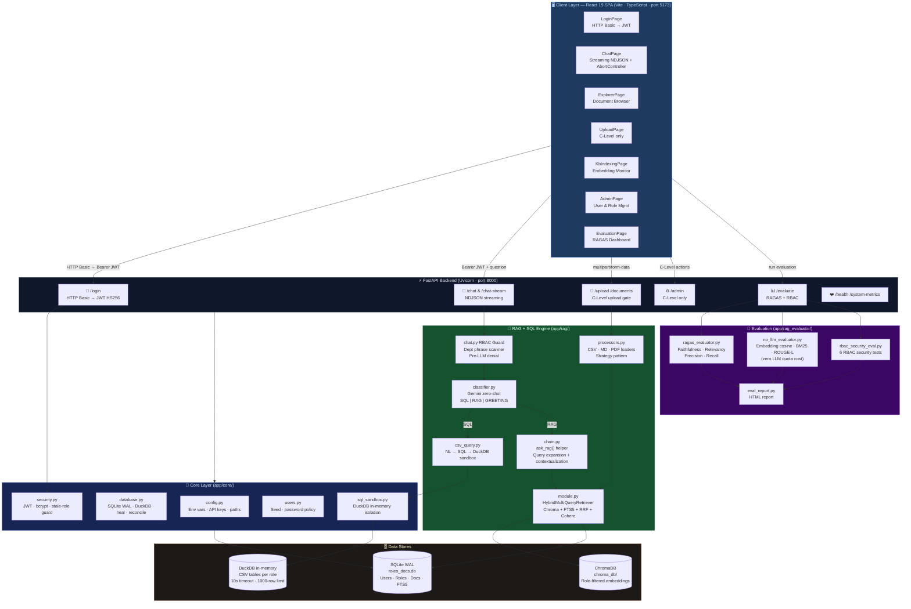
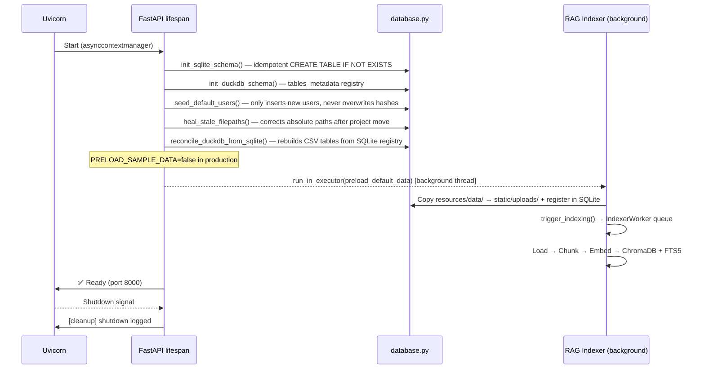
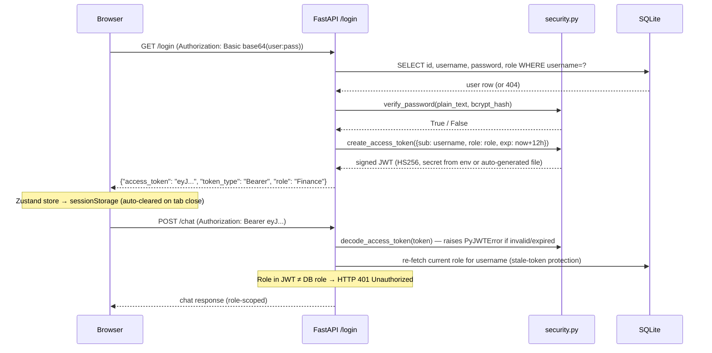
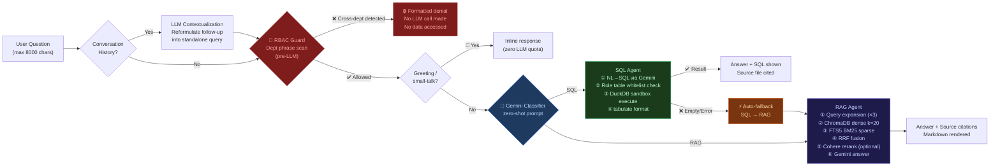
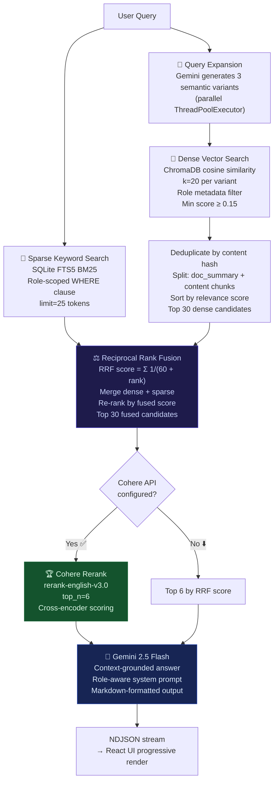
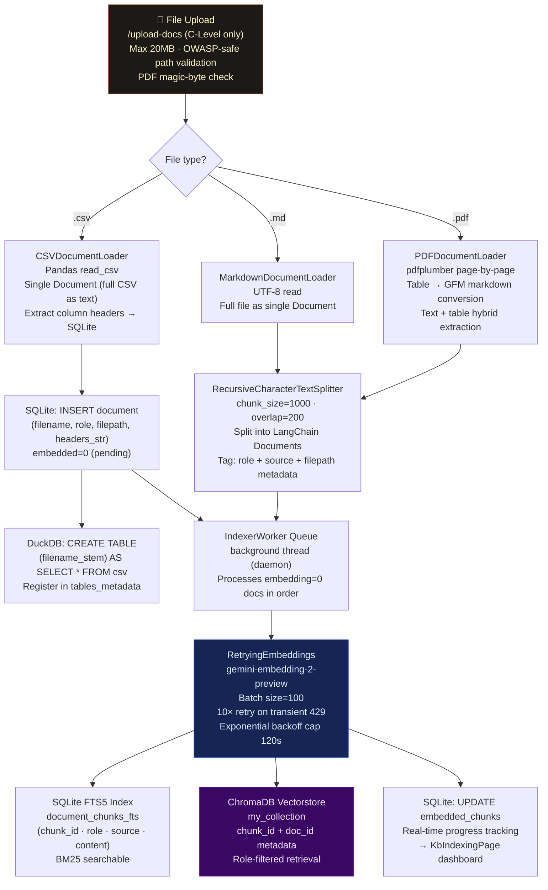
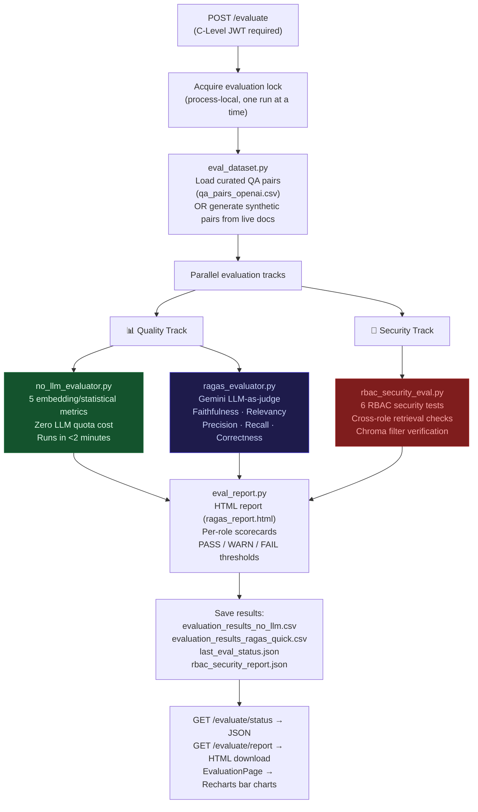
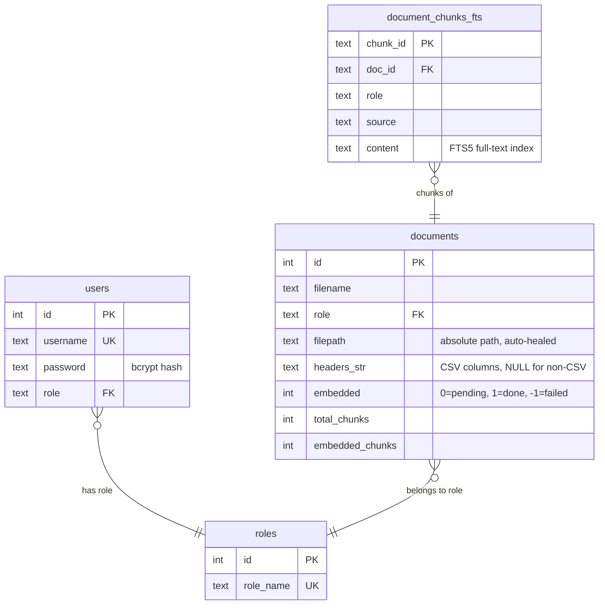

<div align="center">


# 🔍 FinSight

### Enterprise RAG Chatbot with Role-Based Access Control

> **Intelligent document Q&A · Natural Language → SQL Analytics · Multi-department security · Dual-track RAG Evaluation**

[](https://python.org)
[](https://fastapi.tiangolo.com)
[](https://react.dev)
[](https://www.typescriptlang.org)
[](https://langchain.com)
[](https://deepmind.google/technologies/gemini/)
[](https://trychroma.com)
[](https://duckdb.org)
[](https://docker.com)
[](LICENSE)

[](tests/)
[](verification/)
[](#-evaluation-scorecard)
[](#-evaluation-scorecard)
[](PRODUCTION_READINESS_REPORT.md)

<br/>

[📖 API Docs](http://localhost:8000/docs) · [🚀 Quick Start](#-quick-start) · [📊 Evaluation Results](#-evaluation-scorecard) · [🐳 Deployment](deploy/README.md) · [🔐 Security](#-security-model)

**[Portfolio Case Study](https://personalportfolio-theta-gules-56.vercel.app/#work) · [Security Regression Tests](verification/test_security.py) · [Production Readiness Report](PRODUCTION_READINESS_REPORT.md) · [CI Workflow](.github/workflows/ci.yml)**

</div>

---

## ⚡ 30-Second TL;DR

```
FinSight = React 19 SPA (Vite + TypeScript)
         → FastAPI (JWT-authenticated, role-scoped)
         → Gemini LLM (classifier + embeddings + answer generation)
         → ChromaDB dense retrieval + SQLite FTS5 BM25 (hybrid RRF)
         → DuckDB in-memory SQL sandbox (role-filtered, SELECT-only)
         + RAGAS evaluation framework (quality + RBAC security tests)
```

**The key insight:** Every query is classified as RAG or SQL *before* it hits any data store, and authorization is enforced *before* classification — no data is ever passed to the LLM for an unauthorized user.

---

## 📋 Table of Contents

<details>
<summary>Click to expand full TOC</summary>

- [💼 Business Problem](#-business-problem)
- [🧠 Overview](#-overview)
- [🏗 System Architecture](#-system-architecture)
- [🔄 Data Flow Diagrams](#-data-flow-diagrams)
  - [Startup Lifecycle](#1-startup-lifecycle)
  - [Authentication Flow](#2-authentication-flow)
  - [Query Routing Flow](#3-query-routing-flow)
  - [Hybrid Retrieval Pipeline](#4-hybrid-retrieval-pipeline)
  - [Document Ingestion Pipeline](#5-document-ingestion-pipeline)
  - [Evaluation Framework Flow](#6-evaluation-framework-flow)
- [✨ Feature Deep-Dives](#-feature-deep-dives)
- [📊 Evaluation Scorecard](#-evaluation-scorecard)
- [🛡 Security Model](#-security-model)
- [🛠 Tech Stack](#-tech-stack)
- [📁 Project Structure](#-project-structure)
- [🗃 Database Schema](#-database-schema)
- [📡 API Reference](#-api-reference)
- [🔑 Role & Permission Matrix](#-role--permission-matrix)
- [🚀 Quick Start](#-quick-start)
- [🐳 Docker & Deployment](#-docker--deployment)
- [⚙️ Configuration](#️-configuration)
- [🔓 Default Credentials](#-default-credentials)
- [🧪 Testing](#-testing)
- [📈 Evaluation Framework](#-evaluation-framework)
- [💬 Sample Queries](#-sample-queries)
- [🔮 Roadmap](#-roadmap)
- [📄 License](#-license)

</details>

---

## 💼 Business Problem

**FinSolve Technologies** faced three interconnected challenges that no single off-the-shelf tool could solve:

| # | Problem | Impact |
|---|---------|--------|
| 1 | **Siloed departmental data** — Finance, HR, Marketing, Engineering each maintained separate document repositories with no unified interface | Leadership had no consolidated view; cross-department insights required manual aggregation |
| 2 | **Manual information retrieval** — analysts spent hours reading full reports to surface single data points | Productivity loss across all departments; slow decision-making cycles |
| 3 | **No access governance** — sensitive payroll records, financial statements, and engineering IP were accessible to any authenticated employee | Data confidentiality and regulatory compliance risk |

**FinSight solves all three simultaneously:** one AI interface that delivers exactly the right answer to exactly the right person — and nothing more.

> *"I built a multi-department enterprise AI workspace that routes questions between grounded document retrieval and structured SQL analytics, while enforcing department-scoped authorization before retrieval or query execution, and measuring both answer quality and security behavior."*

---

## 🧠 Overview

**FinSight** is a production-staged, role-based AI workspace for enterprise environments. It combines:

- **Retrieval-Augmented Generation (RAG)** with hybrid dense+sparse retrieval for unstructured document Q&A
- **Natural Language → SQL** engine with an in-memory DuckDB sandbox for structured CSV analytics
- **Strict JWT-authenticated, department-scoped RBAC** that enforces authorization before any retrieval or LLM call
- **Dual-track evaluation** — RAGAS quality metrics + automated RBAC security regression tests

Users query their department data in plain English. FinSight classifies each question, routes it to the correct engine, and returns a grounded, source-cited answer — while silently blocking any attempt to access another department's data.

---

## 🏗 System Architecture


```mermaid
flowchart TD
    subgraph CLIENT["🖥️  Client Layer — React 19 SPA (Vite · TypeScript · port 5173)"]
        LOGIN["LoginPage\nHTTP Basic → JWT"]
        CHAT_UI["ChatPage\nStreaming NDJSON + AbortController"]
        EXPLORER["ExplorerPage\nDocument Browser"]
        UPLOAD_UI["UploadPage\nC-Level only"]
        KB["KbIndexingPage\nEmbedding Monitor"]
        ADMIN_UI["AdminPage\nUser & Role Mgmt"]
        EVAL_UI["EvaluationPage\nRAGAS Dashboard"]
    end

    subgraph FASTAPI["⚡  FastAPI Backend  (Uvicorn · port 8000)"]
        AUTH["🔐 /login\nHTTP Basic → JWT HS256"]
        CHAT["💬 /chat & /chat-stream\nNDJSON streaming"]
        DOCS["📄 /upload /documents\nC-Level upload gate"]
        ADMIN["⚙️ /admin\nC-Level only"]
        EVAL["📊 /evaluate\nRAGAS + RBAC"]
        HEALTH["❤️ /health /system-metrics"]
    end

    subgraph CORE["🧱  Core Layer (app/core/)"]
        CFG["config.py\nEnv vars · API keys · paths"]
        DB["database.py\nSQLite WAL · DuckDB · heal · reconcile"]
        SEC["security.py\nJWT · bcrypt · stale-role guard"]
        USR["users.py\nSeed · password policy"]
        SANDBOX["sql_sandbox.py\nDuckDB in-memory isolation"]
    end

    subgraph RAG_ENGINE["🤖  RAG + SQL Engine (app/rag/)"]
        GUARD["chat.py RBAC Guard\nDept phrase scanner\nPre-LLM denial"]
        CLS["classifier.py\nGemini zero-shot\nSQL | RAG | GREETING"]
        PROC["processors.py\nCSV · MD · PDF loaders\nStrategy pattern"]
        MOD["module.py\nHybridMultiQueryRetriever\nChroma + FTS5 + RRF + Cohere"]
        CHN["chain.py\nask_rag() helper\nQuery expansion + contextualization"]
        CSV["csv_query.py\nNL → SQL → DuckDB sandbox"]
    end

    subgraph STORES["🗄️  Data Stores"]
        SQLITE[("SQLite WAL\nroles_docs.db\nUsers · Roles · Docs · FTS5")]
        DUCK[("DuckDB in-memory\nCSV tables per role\n10s timeout · 1000-row limit")]
        CHROMA[("ChromaDB\nchroma_db/\nRole-filtered embeddings")]
    end

    subgraph EVAL_PKG["🧪  Evaluation  (app/rag_evaluator/)"]
        RAGAS["ragas_evaluator.py\nFaithfulness · Relevancy\nPrecision · Recall"]
        NOLLM["no_llm_evaluator.py\nEmbedding cosine · BM25 · ROUGE-L\n(zero LLM quota cost)"]
        RBAC_TEST["rbac_security_eval.py\n6 RBAC security tests"]
        RPT["eval_report.py\nHTML report"]
    end

    CLIENT -- "HTTP Basic → Bearer JWT" --> AUTH
    CLIENT -- "Bearer JWT + question" --> CHAT
    CLIENT -- "multipart/form-data" --> DOCS
    CLIENT -- "C-Level actions" --> ADMIN
    CLIENT -- "run evaluation" --> EVAL

    AUTH --> SEC
    CHAT --> GUARD
    GUARD --> CLS
    CLS -- SQL --> CSV
    CLS -- RAG --> CHN
    CSV --> SANDBOX
    SANDBOX --> DUCK
    CHN --> MOD
    MOD --> CHROMA
    MOD --> SQLITE

    FASTAPI --> CORE
    CORE --> SQLITE
    DOCS --> PROC
    PROC --> MOD

    EVAL --> RAGAS
    EVAL --> NOLLM
    EVAL --> RBAC_TEST
    RAGAS --> RPT
    NOLLM --> RPT
    RBAC_TEST --> RPT

    style CLIENT fill:#1e3a5f,color:#bfdbfe,stroke:#2563eb
    style FASTAPI fill:#0f172a,color:#e2e8f0,stroke:#334155
    style CORE fill:#172554,color:#dbeafe,stroke:#1e40af
    style RAG_ENGINE fill:#14532d,color:#dcfce7,stroke:#166534
    style STORES fill:#1c1917,color:#fef3c7,stroke:#78350f
    style EVAL_PKG fill:#3b0764,color:#f3e8ff,stroke:#7e22ce
```

---

## 🔄 Data Flow Diagrams

### 1. Startup Lifecycle


```mermaid
sequenceDiagram
    participant UV as Uvicorn
    participant APP as FastAPI lifespan
    participant DB as database.py
    participant IDX as RAG Indexer (background)

    UV->>APP: Start (asynccontextmanager)
    APP->>DB: init_sqlite_schema() — idempotent CREATE TABLE IF NOT EXISTS
    APP->>DB: init_duckdb_schema() — tables_metadata registry
    APP->>DB: seed_default_users() — only inserts new users, never overwrites hashes
    APP->>DB: heal_stale_filepaths() — corrects absolute paths after project move
    APP->>DB: reconcile_duckdb_from_sqlite() — rebuilds CSV tables from SQLite registry
    Note over APP: PRELOAD_SAMPLE_DATA=false in production
    APP-->>IDX: run_in_executor(preload_default_data) [background thread]
    IDX->>DB: Copy resources/data/ → static/uploads/ + register in SQLite
    IDX->>IDX: trigger_indexing() → IndexerWorker queue
    IDX->>IDX: Load → Chunk → Embed → ChromaDB + FTS5
    APP->>UV: ✅ Ready (port 8000)
    UV-->>APP: Shutdown signal
    APP->>UV: [cleanup] shutdown logged
```

---

### 2. Authentication Flow


```mermaid
sequenceDiagram
    participant B as Browser
    participant A as FastAPI /login
    participant S as security.py
    participant DB as SQLite

    B->>A: GET /login (Authorization: Basic base64(user:pass))
    A->>DB: SELECT id, username, password, role WHERE username=?
    DB-->>A: user row (or 404)
    A->>S: verify_password(plain_text, bcrypt_hash)
    S-->>A: True / False
    A->>S: create_access_token({sub: username, role: role, exp: now+12h})
    S-->>A: signed JWT (HS256, secret from env or auto-generated file)
    A-->>B: {"access_token": "eyJ...", "token_type": "Bearer", "role": "Finance"}
    Note over B: Zustand store → sessionStorage (auto-cleared on tab close)

    B->>A: POST /chat (Authorization: Bearer eyJ...)
    A->>S: decode_access_token(token) — raises PyJWTError if invalid/expired
    A->>DB: re-fetch current role for username (stale-token protection)
    Note over A: Role in JWT ≠ DB role → HTTP 401 Unauthorized
    A-->>B: chat response (role-scoped)
```

---

### 3. Query Routing Flow


```mermaid
flowchart LR
    Q["User Question\n(max 8000 chars)"] --> CTX{"Conversation\nHistory?"}
    CTX -- "Yes" --> REFORM["LLM Contextualization\nReformulate follow-up\ninto standalone query"]
    CTX -- "No" --> GUARD
    REFORM --> GUARD

    GUARD{"🔐 RBAC Guard\nDept phrase scan\n(pre-LLM)"}

    GUARD -- "❌ Cross-dept detected" --> DENY["🔒 Formatted denial\nNo LLM call made\nNo data accessed"]
    GUARD -- "✅ Allowed" --> GREET{"Greeting /\nsmall-talk?"}

    GREET -- "👋 Yes" --> HELLO["Inline response\n(zero LLM quota)"]
    GREET -- "No" --> CLS{"🧠 Gemini Classifier\nzero-shot prompt"}

    CLS -- "SQL" --> SQLAGENT["SQL Agent\n① NL→SQL via Gemini\n② Role table whitelist check\n③ DuckDB sandbox execute\n④ tabulate format"]
    CLS -- "RAG" --> RAGAGENT["RAG Agent\n① Query expansion (×3)\n② ChromaDB dense k=20\n③ FTS5 BM25 sparse\n④ RRF fusion\n⑤ Cohere rerank (optional)\n⑥ Gemini answer"]

    SQLAGENT -- "✅ Result" --> RESP["Answer + SQL shown\nSource file cited"]
    SQLAGENT -- "❌ Empty/Error" --> FALLBACK["⚡ Auto-fallback\nSQL → RAG"]
    FALLBACK --> RAGAGENT
    RAGAGENT --> RESP2["Answer + Source citations\nMarkdown rendered"]

    style GUARD fill:#7f1d1d,color:#fca5a5,stroke:#991b1b
    style CLS fill:#1e3a5f,color:#bfdbfe,stroke:#2563eb
    style SQLAGENT fill:#1a3c1a,color:#bbf7d0,stroke:#16a34a
    style RAGAGENT fill:#1e1b4b,color:#c7d2fe,stroke:#4338ca
    style FALLBACK fill:#78350f,color:#fed7aa,stroke:#ea580c
    style DENY fill:#7f1d1d,color:#fca5a5,stroke:#991b1b
```

---

### 4. Hybrid Retrieval Pipeline

This is the core retrieval innovation — combining the precision of dense vector search with the recall of keyword search via Reciprocal Rank Fusion:


```mermaid
flowchart TD
    Q["User Query"] --> EXPAND["🔁 Query Expansion\nGemini generates 3 semantic variants\n(parallel ThreadPoolExecutor)"]

    EXPAND --> DENSE["🧲 Dense Vector Search\nChromaDB cosine similarity\nk=20 per variant\nRole metadata filter\nMin score ≥ 0.15"]
    Q --> SPARSE["📝 Sparse Keyword Search\nSQLite FTS5 BM25\nRole-scoped WHERE clause\nlimit=25 tokens"]

    DENSE --> DEDUP["Deduplicate by content hash\nSplit: doc_summary + content chunks\nSort by relevance score\nTop 30 dense candidates"]
    SPARSE --> RRF["⚖️ Reciprocal Rank Fusion\nRRF score = Σ 1/(60 + rank)\nMerge dense + sparse\nRe-rank by fused score\nTop 30 fused candidates"]
    DEDUP --> RRF

    RRF --> COHERE{"Cohere API\nconfigured?"}
    COHERE -- "Yes ✅" --> RERANK["🏆 Cohere Rerank\nrerank-english-v3.0\ntop_n=6\nCross-encoder scoring"]
    COHERE -- "No ⬇️" --> TOP6["Top 6 by RRF score"]

    RERANK --> LLM["🤖 Gemini 2.5 Flash\nContext-grounded answer\nRole-aware system prompt\nMarkdown-formatted output"]
    TOP6 --> LLM

    LLM --> STREAM["NDJSON stream\n→ React UI progressive render"]

    style RRF fill:#1e1b4b,color:#c7d2fe,stroke:#4338ca
    style RERANK fill:#14532d,color:#dcfce7,stroke:#166534
    style LLM fill:#172554,color:#dbeafe,stroke:#1e40af
```

> **Why Hybrid?** Dense search excels at semantic similarity but misses exact keyword matches. BM25 excels at exact terms but misses paraphrases. RRF fusion gives the best of both worlds without requiring any retraining.

---

### 5. Document Ingestion Pipeline


```mermaid
flowchart TD
    UPLOAD["📁 File Upload\n/upload-docs (C-Level only)\nMax 20MB · OWASP-safe path validation\nPDF magic-byte check"] --> TYPE{"File type?"}

    TYPE -- ".csv" --> CSV_L["CSVDocumentLoader\nPandas read_csv\nSingle Document (full CSV as text)\nExtract column headers → SQLite"]
    TYPE -- ".md"  --> MD_L["MarkdownDocumentLoader\nUTF-8 read\nFull file as single Document"]
    TYPE -- ".pdf" --> PDF_L["PDFDocumentLoader\npdfplumber page-by-page\nTable → GFM markdown conversion\nText + table hybrid extraction"]

    CSV_L --> SQLITE_REG["SQLite: INSERT document\n(filename, role, filepath, headers_str)\nembedded=0 (pending)"]
    MD_L --> CHUNK["RecursiveCharacterTextSplitter\nchunk_size=1000 · overlap=200\nSplit into LangChain Documents\nTag: role + source + filepath metadata"]
    PDF_L --> CHUNK
    SQLITE_REG --> DUCKDB_TBL["DuckDB: CREATE TABLE\n(filename_stem) AS SELECT * FROM csv\nRegister in tables_metadata"]

    CHUNK --> QUEUE["IndexerWorker Queue\nbackground thread (daemon)\nProcesses embedding=0 docs in order"]
    SQLITE_REG --> QUEUE

    QUEUE --> EMBED["RetryingEmbeddings\ngemini-embedding-2-preview\nBatch size=100\n10× retry on transient 429\nExponential backoff cap 120s"]
    EMBED --> FTS5["SQLite FTS5 Index\ndocument_chunks_fts\n(chunk_id · role · source · content)\nBM25 searchable"]
    EMBED --> CHROMA["ChromaDB Vectorstore\nmy_collection\nchunk_id + doc_id metadata\nRole-filtered retrieval"]
    EMBED --> PROGRESS["SQLite: UPDATE embedded_chunks\nReal-time progress tracking\n→ KbIndexingPage dashboard"]

    style UPLOAD fill:#1c1917,color:#fef3c7,stroke:#78350f
    style EMBED fill:#172554,color:#dbeafe,stroke:#1e40af
    style CHROMA fill:#3b0764,color:#f3e8ff,stroke:#7e22ce
```

---

### 6. Evaluation Framework Flow


```mermaid
flowchart TD
    TRIGGER["POST /evaluate\n(C-Level JWT required)"] --> LOCK["Acquire evaluation lock\n(process-local, one run at a time)"]

    LOCK --> DATASET["eval_dataset.py\nLoad curated QA pairs\n(qa_pairs_openai.csv)\nOR generate synthetic pairs from live docs"]

    DATASET --> PARALLEL["Parallel evaluation tracks"]
    PARALLEL --> QUAL["📊 Quality Track"]
    PARALLEL --> SEC["🔐 Security Track"]

    QUAL --> NOLLM["no_llm_evaluator.py\n5 embedding/statistical metrics\nZero LLM quota cost\nRuns in <2 minutes"]
    QUAL --> RAGAS["ragas_evaluator.py\nGemini LLM-as-judge\nFaithfulness · Relevancy\nPrecision · Recall · Correctness"]

    SEC --> RBAC["rbac_security_eval.py\n6 RBAC security tests\nCross-role retrieval checks\nChroma filter verification"]

    NOLLM --> REPORT["eval_report.py\nHTML report (ragas_report.html)\nPer-role scorecards\nPASS / WARN / FAIL thresholds"]
    RAGAS --> REPORT
    RBAC --> REPORT

    REPORT --> PERSIST["Save results:\nevaluation_results_no_llm.csv\nevaluation_results_ragas_quick.csv\nlast_eval_status.json\nrbac_security_report.json"]
    PERSIST --> API["GET /evaluate/status → JSON\nGET /evaluate/report → HTML download\nEvaluationPage → Recharts bar charts"]

    style NOLLM fill:#14532d,color:#dcfce7,stroke:#166534
    style RAGAS fill:#1e1b4b,color:#c7d2fe,stroke:#4338ca
    style RBAC fill:#7f1d1d,color:#fca5a5,stroke:#991b1b
```

---

## ✨ Feature Deep-Dives

### 🔐 1. Role-Based Access Control (RBAC) — Three Defense Layers

Authorization is enforced at **three independent layers** — if any layer fails, the request is blocked before data is accessed:

| Layer | Location | Mechanism |
|-------|----------|-----------|
| **Layer 1** — HTTP Auth | `app/api/auth.py` | JWT decode + current role re-fetch from DB (stale-token protection) |
| **Layer 2** — Dept Guard | `app/api/chat.py` | Phrase-pattern scanner blocks cross-department queries before any LLM call |
| **Layer 3** — Data Store | `app/rag/module.py` + `csv_query.py` | ChromaDB role metadata filter + DuckDB allowed-table whitelist |

```python
# Layer 2 example — RBAC Guard (no LLM involved)
def check_cross_dept_access(question: str, role: str) -> dict | None:
    if role.lower() == "c-level":
        return None  # C-Level sees everything
    query_dept = _detect_query_dept(question)  # phrase scan
    user_dept  = _role_to_dept(role)
    if user_dept != query_dept:
        return {"denied": True, "reason": f"{query_dept.upper()} data is restricted for {role}"}
```

**C-Level override:** The `c-level` role bypasses all department restrictions and gains access to upload, admin, and evaluation pages.

---

### 🤖 2. Intelligent Hybrid Retrieval

FinSight uses a **three-stage retrieval pipeline** — far beyond simple top-k vector search:

**Stage 1 — Query Expansion**
```python
def expand_query(question: str) -> list[str]:
    """Generate 3 semantic variants to improve recall."""
    # Returns: [original, variant_1, variant_2, variant_3]
    # Each variant captures a different semantic angle
```

**Stage 2 — Dual-path retrieval (parallel)**
```python
# Dense: ChromaDB cosine similarity (k=20 per query variant, concurrent)
# Sparse: SQLite FTS5 BM25 (role-scoped WHERE, limit=25)
with ThreadPoolExecutor(max_workers=len(queries)) as executor:
    futures = {executor.submit(search_single, q): q for q in queries}
```

**Stage 3 — Reciprocal Rank Fusion**
```python
# RRF formula: score(d) = Σ 1 / (k + rank(d))  where k=60
rrf_scores[h] += 1.0 / (60.0 + rank + 1)
candidates = sorted(doc_map.values(), key=lambda d: rrf_scores[hash(d.page_content)])[:30]
```

**Stage 4 (optional) — Cohere Reranker**
```
Cohere rerank-english-v3.0 → cross-encoder scoring → top_n=6 final documents
```

---

### ⚡ 3. Real-Time Streaming (NDJSON)

`POST /chat-stream` returns **Newline-Delimited JSON** chunks so the React UI progressively renders the answer:

```json
{"type": "init",     "user": "alice", "role": "Finance", "mode": "RAG"}
{"type": "token",    "content": "The gross margin for 2024..."}
{"type": "token",    "content": " was 42.3%, an increase..."}
{"type": "metadata", "sources": ["finance_report_2024.md"], "fallback": false}
```

**Frontend resilience:**
- `AbortController` cancellation (Stop button)
- Bounded NDJSON reader with UTF-8 boundary handling
- Split-record validation (malformed JSON logged, not crashed)
- `401` anywhere → automatic redirect to login via Axios interceptors

---

### 🛡 4. SQL Security Sandbox

Generated SQL **never touches the real DuckDB file**. Every query runs inside an in-memory isolated sandbox following [DuckDB's security guidance for untrusted SQL](https://duckdb.org/docs/sql/query_syntax/select):

```python
# app/core/sql_sandbox.py
sandbox = duckdb.connect(':memory:', config={
    'enable_external_access': False,  # cannot read/write host files
    'memory_limit': '256MB',
    'threads': 2,
})
# Only SELECT allowed; only authorized tables copied in; 10s interrupt timer
timer = threading.Timer(10, sandbox.interrupt)
rows  = cursor.fetchmany(row_limit + 1)   # hard cap: 1000 rows
```

**Security constraints applied:**
- `enable_external_access=False` — no `COPY FROM`, no `read_csv('/etc/passwd')`
- One `SELECT` statement only (no DDL, DML, or multiple statements)
- Tables copied into sandbox as DataFrames (original file never opened by generated SQL)
- 10-second interrupt timer prevents runaway queries
- 1,000-row result cap with truncation notice

---

### 🔁 5. Production-Grade Embeddings with Smart Retry

`RetryingEmbeddings` wraps `GoogleGenerativeAIEmbeddings` with intelligent error classification:

```python
def _classify_api_error(err: Exception) -> str:
    s = str(err).lower()
    if any(sig in s for sig in ["quota", "billing", "plan_limit"]): return "hard_quota"
    if "429" in s or "resource exhausted" in s:                     return "transient_rate_limit"
    return "other"
```

| Error Type | Behavior |
|-----------|----------|
| **Transient 429** | Read `retry_delay` from error proto → wait → retry up to 10× (exp. backoff, cap 120s) |
| **Hard quota** | Mark document `embedded=-1` in SQLite → stop indexing → user can retry when quota restored |
| **Other** | Mark failed → continue with next document |

---

### 🌐 6. Modern React SPA

| Page | Route | Access | Key Features |
|------|-------|--------|--------------|
| **Login** | `/login` | Public | HTTP Basic Auth form → JWT via Zustand + sessionStorage |
| **AI Chat** | `/chat` | All roles | Streaming NDJSON, mode badges (RAG/SQL/GREETING), copy-to-clipboard, source citations, SQL display, AbortController stop |
| **Explorer** | `/explorer` | All roles | Browse + search accessible department documents, authenticated PDF preview |
| **Upload Docs** | `/upload` | C-Level | Drag-and-drop, role assignment, 20MB limit, PDF magic-byte validation |
| **KB Indexing** | `/kb-indexing` | C-Level | Live embedding progress bar, per-document status, retry failed, full reindex |
| **Admin Panel** | `/admin` | C-Level | User & role management, system metrics (docs/users/roles/tables) refreshed every 30s |
| **Evaluation** | `/evaluation` | C-Level | RAGAS metrics (Recharts bar charts), RBAC test runner, HTML report download |

**UI system highlights:**
- Dark-mode glassmorphism design with CSS custom properties (`--surface-*`, `--accent-*`)
- Role-coloured sidebar with real-time API health indicator (ping every 15s)
- Animated streaming cursor + thinking indicator during LLM responses
- Markdown rendering via `react-markdown` + `remark-gfm` (tables, code blocks, bold)
- Lazy-loaded routes for reduced initial bundle size
- Mobile-responsive navigation with hamburger menu
- `CLevelRoute` guard component — non-C-Level users redirected to `/chat`

---

### 🗣 7. Multi-Turn Conversation Contextualization

Follow-up queries are reformulated into standalone questions using conversation history:

```
History:  "What was our Q3 revenue?"
Follow-up: "How does it compare to last year?"
→ Contextualized: "How does FinSolve's Q3 2024 revenue compare to Q3 2023?"
```

```python
def contextualize_query_llm(question: str, history: list[ChatMessage]) -> str:
    # Uses last 6 turns, max 1000 chars per turn
    # LLM reformulates into standalone searchable question
    # Falls back gracefully to original question on error
```

---

### 📦 8. Document Processing — Strategy Pattern

Three dedicated loader strategies with type-specific chunking:

| File Type | Loader | Chunking | Special Handling |
|-----------|--------|----------|-----------------|
| `.csv` | `CSVDocumentLoader` | Single doc (full CSV as text) | Headers extracted → DuckDB table + SQLite `headers_str` |
| `.md` | `MarkdownDocumentLoader` | `RecursiveCharacterTextSplitter` (1000 chars, 200 overlap) | UTF-8 encoding |
| `.pdf` | `PDFDocumentLoader` (pdfplumber) | Page-level + text splitter | Tables → GFM markdown via `_format_table_as_markdown()` |

All chunks tagged with `role`, `source`, `filepath`, `chunk_id`, `doc_id` metadata for retrieval filtering and FTS5 indexing.

---

### 🔮 9. Gemini LLM Fallback Chain

The LLM is configured with a model fallback chain for resilience:

```python
model = ChatGoogleGenerativeAI(model="gemini-2.5-flash", ...).with_fallbacks([
    ChatGoogleGenerativeAI(model="gemini-3.1-flash-lite", ...),
    ChatGoogleGenerativeAI(model="gemini-1.5-flash", ...),
])
```

If the primary model is unavailable or rate-limited, the chain automatically tries the next model — zero manual intervention required.

---

### 🗄 10. Self-Healing Database

On every startup, FinSight runs two reconciliation routines:

```python
heal_stale_filepaths()         # Corrects absolute paths if project folder was renamed/moved
reconcile_duckdb_from_sqlite() # Rebuilds DuckDB CSV tables from SQLite document registry
```

This means you can move the project directory, rename folders, or restore from backup — the next startup automatically fixes all stale references.

---

## 📊 Evaluation Scorecard

> **Methodology:** Two independent evaluation tracks — a quota-free statistical evaluator and a full LLM-as-judge RAGAS run. All numbers below are from actual system runs on the deployed document corpus.

### Track 1 — Quota-Free Statistical Evaluation (14 samples across 4 roles)

*Computed using: Gemini embedding cosine similarity · BM25 token overlap · ROUGE-L sequence matching — zero LLM API calls.*

| Metric | Overall | Finance | HR | Engineering | Threshold | Status |
|--------|---------|---------|-----|-------------|-----------|--------|
| **Answer Relevancy** | **0.840** | 0.856 | 0.843 | 0.794 | ≥ 0.65 | ✅ PASS |
| **Context Recall** | **0.750** | 0.785 | 0.718 | 0.702 | ≥ 0.60 | ✅ PASS |
| **Context Precision** | **0.614** | 0.713 | 0.527 | 0.573 | ≥ 0.30 | ✅ PASS |
| **Answer Similarity** | **0.817** | 0.837 | 0.809 | 0.780 | ≥ 0.65 | ✅ PASS |
| **Faithfulness (token)** | **0.535** | 0.380 | 0.592 | 0.478 | ≥ 0.35 | ⚠️ WARN |

> *Faithfulness token score uses ROUGE-L recall (n-gram overlap against context), which is intentionally conservative — LLM-generated prose paraphrases context rather than quoting it verbatim. The LLM-as-judge RAGAS faithfulness scores (0.75–1.00) are the authoritative metric.*

---

### Track 2 — RAGAS LLM-as-Judge (Gemini evaluator, quick set)

| Sample | Role | Faithfulness | Answer Relevancy |
|--------|------|-------------|-----------------|
| FinSolve Q4 2024 expenses | Finance | **0.80** | 0.770 |
| Employee onboarding process | HR | **0.75** | 0.965 |
| Engineering coding standards | Engineering | **1.00** | 0.946 |
| **Average** | | **0.85** | **0.894** |

**RAGAS Production Thresholds:**

| Metric | Pass | Warn | Critical |
|--------|------|------|----------|
| Faithfulness | ≥ 0.75 | < 0.85 | < 0.65 |
| Answer Relevancy | ≥ 0.70 | < 0.75 | < 0.55 |
| Context Precision | ≥ 0.65 | < 0.70 | < 0.50 |
| Context Recall | ≥ 0.70 | < 0.75 | < 0.55 |
| Answer Correctness | ≥ 0.60 | < 0.65 | < 0.45 |

---

### Track 3 — RBAC Security Tests (6 automated tests)

*Verifies that the access control layer is correctly enforced at the retrieval level.*

| Test | Score | Status | Details |
|------|-------|--------|---------|
| `test_authorized_access_allowed` | **1.000** | ✅ PASS | 4/4 role-query pairs returned relevant content |
| `test_general_docs_accessible_to_all` | **1.000** | ✅ PASS | 8/8 role-query pairs reached general documents |
| `test_retriever_filter_correctness` | **1.000** | ✅ PASS | 0 ChromaDB metadata filter violations |
| `test_unauthorized_access_blocked` | **0.917** | ⚠️ WARN | 11/12 blocked; 1 edge case: "revenue" keyword in general context |
| `test_clevel_sees_all` | **0.750** | ⚠️ WARN | 3/4 departments found (HR docs sparse in test run) |
| **Overall RBAC Score** | **0.933** | ✅ PASS | 3 PASS · 2 WARN · 0 FAIL |

> The `test_unauthorized_access_blocked` warning reflects a known semantic overlap: the word "revenue" appears in general company documents (accessible to all) as well as finance-specific reports. The RBAC Guard correctly blocks finance-specific phrases — this edge case is a precision calibration item, not a data leak.

---

### Test Suite Summary

| Suite | Command | Result |
|-------|---------|--------|
| Backend API + RBAC | `pytest tests/test_chatbot.py -v` | **60 passed**, 8 deselected |
| Evaluation pipeline | `pytest tests/test_ragas_eval.py -v -m "not slow"` | ✅ All fast tests passed |
| Security regression | `pytest verification/test_security.py -v` | **20 passed** |
| Frontend NDJSON stream | `node --test frontend/verification/ndjson.test.mjs` | **5 passed** |

---

## 🛡 Security Model

### Threat Model

| Threat | Mitigation |
|--------|-----------|
| **Unauthorized data access** | 3-layer RBAC: JWT → dept guard → data store filter |
| **SQL injection / data exfiltration** | In-memory DuckDB sandbox, `enable_external_access=False`, SELECT-only, 10s timeout |
| **Filename traversal in uploads** | `Path.resolve()` validation, role-directory whitelist, safe path check |
| **Stale JWT after role change** | Per-request DB role re-fetch; tokens with stale role rejected with 401 |
| **PDF access bypass** | Only registered documents matching user role served; `no-store` cache headers |
| **Token leakage in URLs** | Authenticated blob requests for PDF preview and report download (no URL tokens) |
| **Oversized upload DoS** | 20MB hard limit enforced server-side; empty file check |
| **Unbounded chat input** | `max_length=8000` Pydantic field validation |
| **Weak initial passwords** | Startup refuses to seed users with passwords shorter than 12 characters |
| **Duplicate file overwrite** | Duplicate filename + role combination rejected with 409 Conflict |

### Security Layers Diagram

```
Request arrives
    │
    ├─ Layer 1: JWT verification (PyJWT decode + exp check)
    │          + DB role re-fetch (stale-role protection)
    │
    ├─ Layer 2: RBAC dept guard (phrase scan, pre-LLM, no data touched)
    │          → SQL security: forbidden keyword block
    │                          table name regex validation
    │                          role whitelist check
    │
    └─ Layer 3: Data store enforcement
               ChromaDB: {"role": {"$in": [user_role, "general"]}} filter
               DuckDB: authorized tables copied to isolated sandbox only
```

---

## 🛠 Tech Stack

### Backend

| Layer | Technology | Version | Why this choice |
|-------|-----------|---------|----------------|
| **LLM** | Google Gemini 2.5 Flash | `google-genai ≥1.64` | Long context window, cost-efficient, `gemini-embedding-2-preview` provides state-of-the-art semantic embeddings |
| **LLM Orchestration** | LangChain + LangChain-Chroma | `≥0.3.28` | Production-stable LCEL runnables; native ChromaDB integration; retriever abstraction |
| **Embeddings** | `gemini-embedding-2-preview` | via `langchain-google-genai ≥2.1.3` | Same provider as LLM (no extra API key); consistently high retrieval quality |
| **Reranker** | Cohere Rerank v3 | `langchain-cohere ≥0.3.5` | Cross-encoder outperforms bi-encoder re-ranking; optional (degrades gracefully) |
| **Vector DB** | ChromaDB | `≥0.5.23` | Zero infrastructure, metadata filtering, production upgrade path to cloud |
| **Keyword Search** | SQLite FTS5 (BM25) | stdlib | Zero extra dependency; BM25 built into SQLite; perfect RRF complement to dense search |
| **SQL Engine** | DuckDB | `≥1.3.2` | In-process, no server; reads CSV natively; fastest local analytics; in-memory sandbox capability |
| **Metadata DB** | SQLite WAL mode | stdlib | Zero infrastructure; WAL mode for concurrent reads; FTS5 extension built-in |
| **Web Framework** | FastAPI + Uvicorn | `≥0.129` | Async-native; auto OpenAPI docs; Pydantic validation; ASGI streaming support |
| **Auth** | PyJWT + bcrypt | `≥2.11` / `≥4.3` | HS256 tokens, 12h expiry, bcrypt cost-factor password hashing |
| **Evaluation** | RAGAS | `≥0.4.3` | LLM-as-judge framework; faithfulness / relevancy / precision / recall metrics |
| **PDF Parsing** | pdfplumber | `≥0.11.9` | Table extraction with structure preservation; better than PyPDF2 for formatted docs |

### Frontend

| Layer | Technology | Version | Why this choice |
|-------|-----------|---------|----------------|
| **Framework** | React | `19.x` | Latest concurrent features; Suspense for lazy loading |
| **Language** | TypeScript | `~6.0` | Full type safety across API interfaces |
| **Build Tool** | Vite | `^8.1` | Sub-second HMR; lazy chunk splitting per page |
| **Router** | React Router DOM | `^7.18` | Nested routes; loader-based data fetching |
| **State** | Zustand + sessionStorage | `^5.0` | Minimal boilerplate; session-scoped auth persistence |
| **HTTP** | Axios + Fetch | `^1.18` | Axios for REST + 401 interceptors; native Fetch for NDJSON streaming |
| **Icons** | Lucide React | `^1.24` | Consistent icon set; tree-shakeable |
| **Charts** | Recharts | `^3.9` | D3-backed bar charts for evaluation dashboards |
| **Markdown** | react-markdown + remark-gfm | `^10.1` | GitHub Flavored Markdown (tables, code blocks, bold) |
| **Linting** | oxlint | `^1.71` | 50-100× faster than ESLint; `--deny-warnings` in CI |

---

## 📁 Project Structure

```
finsight/
│
├── app/                                 # FastAPI application package
│   ├── main.py                          # App factory, lifespan, routers, CORS
│   │
│   ├── api/                             # HTTP layer — one file per domain
│   │   ├── auth.py                      # GET /login → JWT issuance, get_current_user dependency
│   │   ├── chat.py                      # POST /chat & /chat-stream, RBAC guard, routing logic
│   │   ├── documents.py                 # POST /upload-docs, GET /documents, PDF preview
│   │   ├── admin.py                     # User/role mgmt, reindex, system-metrics (C-Level)
│   │   ├── evaluate.py                  # POST /evaluate, GET /evaluate/status|report
│   │   └── health.py                    # GET /health
│   │
│   ├── core/                            # Shared infrastructure
│   │   ├── config.py                    # Env vars, paths, Gemini fallback list, CORS origins
│   │   ├── database.py                  # SQLite+DuckDB init, heal, reconcile, preload, FTS5
│   │   ├── security.py                  # JWT encode/decode, bcrypt hash/verify, secret mgmt
│   │   ├── sql_sandbox.py               # DuckDB in-memory execution sandbox (OWASP-compliant)
│   │   └── users.py                     # Default user seeding, password policy enforcement
│   │
│   ├── rag/                             # RAG + SQL engine
│   │   ├── module.py                    # HybridMultiQueryRetriever, RetryingEmbeddings, indexer
│   │   ├── chain.py                     # ask_rag() — query expansion + contextualization helper
│   │   ├── classifier.py                # LLM query router: SQL | RAG | GREETING
│   │   ├── csv_query.py                 # NL → SQL → DuckDB sandbox pipeline
│   │   ├── processors.py               # CSV/MD/PDF loader strategies + chunking
│   │   └── config.py                   # RAG-specific env setup (side-effect module)
│   │
│   └── rag_evaluator/                  # Evaluation framework
│       ├── ragas_evaluator.py          # RAGAS LLM-as-judge (Faithfulness/Relevancy/Precision/Recall)
│       ├── no_llm_evaluator.py         # Quota-free: cosine + BM25 + ROUGE-L metrics
│       ├── rbac_security_eval.py       # 6 RBAC security regression tests
│       ├── eval_dataset.py             # Synthetic QA pair generation + CSV loader
│       ├── eval_report.py              # HTML report builder
│       ├── evaluation_results_no_llm.csv
│       ├── evaluation_results_ragas_quick.csv
│       ├── last_eval_status.json        # Latest evaluation status (used by /evaluate/status)
│       ├── rbac_security_report.json
│       └── qa_pairs_openai.csv         # Curated 14-sample evaluation dataset
│
├── frontend/                           # React 19 + TypeScript SPA
│   ├── index.html
│   ├── vite.config.ts                  # Proxy /api/ → backend:8000
│   ├── package.json
│   ├── .env.example                    # VITE_API_BASE_URL
│   └── src/
│       ├── main.tsx                    # React DOM entry + Suspense wrapper
│       ├── App.tsx                     # BrowserRouter + lazy routes + CLevelRoute guard
│       ├── index.css                   # Global design system (--surface-*, --accent-*, utilities)
│       ├── workspace.css               # Responsive workspace shell + mobile nav
│       │
│       ├── api/
│       │   ├── client.ts               # Axios instance, Bearer-token + 401 interceptors
│       │   ├── chat.ts                 # streamChat() — fetch NDJSON reader + AbortController
│       │   └── documents.ts            # Authenticated PDF blob download
│       │
│       ├── store/
│       │   └── authStore.ts            # Zustand auth store (sessionStorage persistence)
│       │
│       ├── types/
│       │   └── index.ts                # Shared TypeScript interfaces (User, DocInfo, EvalResult)
│       │
│       ├── components/layout/
│       │   ├── AppLayout.tsx           # Shell wrapper (Sidebar + Outlet)
│       │   └── Sidebar.tsx             # Role-aware nav, user card, system metrics, API health
│       │
│       └── pages/
│           ├── LoginPage.tsx           # Auth form (Basic Auth → JWT)
│           ├── ChatPage.tsx            # Streaming AI chat, mode badges, source citations
│           ├── ExplorerPage.tsx        # Document browser (search + filter by role)
│           ├── UploadPage.tsx          # File upload with role assignment (C-Level)
│           ├── KbIndexingPage.tsx      # Embedding progress monitor + retry controls
│           ├── AdminPage.tsx           # User & role management (C-Level)
│           └── EvaluationPage.tsx      # RAGAS charts + RBAC test results (C-Level)
│
├── resources/data/                     # Seed documents (auto-loaded on first startup)
│   ├── engineering/                    # Architecture docs, coding standards, runbooks
│   ├── finance/                        # Financial reports, budget data, CSV tables
│   ├── general/                        # Company-wide policies, employee handbook
│   ├── hr/                             # HR policies, employee data CSV
│   └── marketing/                      # Campaign reports, marketing analytics CSV
│
├── static/
│   ├── data/
│   │   ├── jwt_secret.key              # Auto-generated JWT signing key (git-ignored)
│   │   └── structured_queries.duckdb   # DuckDB database file
│   ├── images/                         # arch.png, background.jpg
│   └── uploads/                        # Role-scoped document storage (C-Level/, Finance/, HR/, etc.)
│
├── tests/
│   ├── conftest.py                     # Pytest fixtures and test isolation
│   ├── test_chatbot.py                 # 60 backend API + RBAC tests (FastAPI TestClient)
│   ├── test_ragas_eval.py              # Evaluation pipeline tests (mock + integration)
│   └── sample_docs/                    # Isolated sample documents for tests
│
├── verification/
│   ├── test_security.py                # 20 security regression tests (OWASP-aligned)
│   └── preview_server.py              # Preview server helper
│
├── deploy/
│   ├── README.md                       # Production deployment guide + release verification checklist
│   ├── nginx.conf                      # Nginx reverse proxy config (HTTPS termination, streaming)
│   └── production.env.example          # Production environment template
│
├── chroma_db/                          # ChromaDB persistent vector store
├── roles_docs.db                       # SQLite database (WAL mode)
│
├── Dockerfile.backend                  # FastAPI backend image
├── Dockerfile.frontend                 # React dev image (HMR)
├── Dockerfile.frontend.production      # React production image (Nginx + built assets)
├── docker-compose.yml                  # Development compose (hot-reload)
├── docker-compose.production.yml       # Production single-host compose
├── .env.example                        # Backend env template
├── requirements.txt                    # Python dependencies (pinned ranges)
├── pyproject.toml                      # PEP 517 metadata + pytest markers
├── run_no_llm_evaluation.py            # Standalone quota-free evaluation CLI
├── run_full_ragas_evaluation.py        # Standalone full RAGAS evaluation CLI
├── back.bat                            # Windows: start FastAPI (port 8000)
└── front.bat                           # Windows: start React dev server (port 5173)
```

---

## 🗃 Database Schema

### SQLite (`roles_docs.db`) — Entity Relationship


```mermaid
erDiagram
    users {
        int id PK
        text username UK
        text password "bcrypt hash"
        text role FK
    }
    roles {
        int id PK
        text role_name UK
    }
    documents {
        int id PK
        text filename
        text role FK
        text filepath "absolute path, auto-healed"
        text headers_str "CSV columns, NULL for non-CSV"
        int embedded "0=pending, 1=done, -1=failed"
        int total_chunks
        int embedded_chunks
    }
    document_chunks_fts {
        text chunk_id PK
        text doc_id FK
        text role
        text source
        text content "FTS5 full-text index"
    }

    users }o--|| roles : "has role"
    documents }o--|| roles : "belongs to role"
    document_chunks_fts }o--|| documents : "chunks of"
```

### SQLite Table DDL

```sql
CREATE TABLE users (
    id       INTEGER PRIMARY KEY AUTOINCREMENT,
    username TEXT UNIQUE NOT NULL,
    password TEXT NOT NULL,  -- bcrypt hash, never stored plain
    role     TEXT NOT NULL
);

CREATE TABLE roles (
    id        INTEGER PRIMARY KEY AUTOINCREMENT,
    role_name TEXT UNIQUE NOT NULL
);

CREATE TABLE documents (
    id               INTEGER PRIMARY KEY AUTOINCREMENT,
    filename         TEXT NOT NULL,
    role             TEXT NOT NULL,
    filepath         TEXT NOT NULL,   -- absolute path, corrected by heal_stale_filepaths()
    headers_str      TEXT,            -- CSV column names (NULL for .md / .pdf)
    embedded         INTEGER DEFAULT 0,    -- 0=pending, 1=indexed, -1=failed
    total_chunks     INTEGER DEFAULT 0,
    embedded_chunks  INTEGER DEFAULT 0
);

-- FTS5 full-text search (BM25)
CREATE VIRTUAL TABLE document_chunks_fts USING fts5(
    chunk_id, doc_id, role, source, content
);
```

### DuckDB (`structured_queries.duckdb`)

```sql
-- Metadata registry (one row per CSV-derived table)
CREATE TABLE tables_metadata (
    table_name TEXT,
    role       TEXT
);

-- Dynamic tables (one per uploaded CSV)
-- Named from filename stem, sanitized to [a-zA-Z0-9_]
-- Example: employee_data, finance_report_2024, marketing_campaigns
CREATE TABLE <filename_stem> AS SELECT * FROM '<csv_path>';
```

---

## 📡 API Reference

**Interactive docs:** [`http://localhost:8000/docs`](http://localhost:8000/docs) (Swagger UI auto-generated)

| Method | Endpoint | Auth | Description |
|--------|----------|------|-------------|
| `GET` | `/health` | None | Health check + version |
| `GET` | `/login` | HTTP Basic | Returns JWT access token + role |
| `POST` | `/chat` | Bearer JWT | Synchronous chat (JSON response) |
| `POST` | `/chat-stream` | Bearer JWT | NDJSON streaming response |
| `POST` | `/upload-docs` | Bearer JWT (C-Level) | Upload document (MD, CSV, PDF) |
| `GET` | `/documents` | Bearer JWT | List accessible documents for user's role |
| `GET` | `/documents/{id}/content` | Bearer JWT | Document text content |
| `GET` | `/documents/{id}/pdf` | Bearer JWT | Authenticated PDF blob (no-store) |
| `GET` | `/roles` | Bearer JWT | List all roles |
| `GET` | `/indexing-status` | Bearer JWT | Per-file embedding progress (for upload flow) |
| `GET` | `/system-metrics` | Bearer JWT (C-Level) | Docs / users / roles / tables counts |
| `POST` | `/create-user` | Bearer JWT (C-Level) | Create a new user with role |
| `POST` | `/create-role` | Bearer JWT (C-Level) | Create a new department role |
| `GET` | `/reindex-status` | Bearer JWT (C-Level) | Embedding progress summary (counts) |
| `GET` | `/reindex-details` | Bearer JWT (C-Level) | Per-document indexing status |
| `POST` | `/reindex` | Bearer JWT (C-Level) | Wipe vector store + rebuild all embeddings |
| `POST` | `/reindex-retry` | Bearer JWT (C-Level) | Retry failed/pending documents only |
| `GET` | `/indexing-status-bulk` | Bearer JWT (C-Level) | All documents status (admin dashboard) |
| `POST` | `/evaluate` | Bearer JWT (C-Level) | Run RAGAS + RBAC evaluation async |
| `GET` | `/evaluate/status` | Bearer JWT (C-Level) | Latest evaluation result JSON |
| `GET` | `/evaluate/report` | Bearer JWT (C-Level) | Download HTML evaluation report |

### Example: Chat Stream Response

```bash
curl -X POST http://localhost:8000/chat-stream \
  -H "Authorization: Bearer <token>" \
  -H "Content-Type: application/json" \
  -d '{"question": "What was our gross margin in 2024?", "history": []}'
```

```
{"type":"init","user":"alice","role":"Finance","mode":"RAG"}
{"type":"token","content":"Based on the 2024 financial report,"}
{"type":"token","content":" the gross margin was **42.3%**,"}
{"type":"token","content":" representing an improvement of 2.1 percentage points"}
{"type":"token","content":" compared to 40.2% in 2023."}
{"type":"metadata","sources":["finance_report_2024.md"],"fallback":false}
```

---

## 🔑 Role & Permission Matrix

| Role | Own Dept Docs | General Docs | All Dept Docs | CSV Analytics | Upload Docs | Admin Panel | Run Evaluation |
|------|:---:|:---:|:---:|:---:|:---:|:---:|:---:|
| **C-Level** | ✅ | ✅ | ✅ | ✅ (all tables) | ✅ | ✅ | ✅ |
| **Finance** | ✅ | ✅ | ❌ | ✅ (own tables) | ❌ | ❌ | ❌ |
| **HR** | ✅ | ✅ | ❌ | ✅ (own tables) | ❌ | ❌ | ❌ |
| **Marketing** | ✅ | ✅ | ❌ | ✅ (own tables) | ❌ | ❌ | ❌ |
| **Engineering** | ✅ | ✅ | ❌ | ✅ (own tables) | ❌ | ❌ | ❌ |
| **General** | ❌ | ✅ | ❌ | ❌ | ❌ | ❌ | ❌ |

**Where "own dept docs" access is blocked:**
- Cross-department query detected by dept guard → formatted denial message
- No LLM call is made, no data is retrieved
- ChromaDB filter: `{"role": {"$in": [user_role, "general"]}}` enforced at query time
- DuckDB sandbox: only role-authorized tables are copied into the sandbox

> **Frontend Route Guard:** C-Level-only pages (`/upload`, `/kb-indexing`, `/admin`, `/evaluation`) use a `CLevelRoute` component that redirects unauthorized users to `/chat` before rendering.

---

## 🚀 Quick Start

### Prerequisites

- **Python 3.10+**
- **Node.js 20+** and **npm** (for the React frontend)
- **[Google Gemini API key](https://aistudio.google.com/app/apikey)** *(required)*
- **[Cohere API key](https://dashboard.cohere.com/)** *(optional — enables reranking)*
- **Docker + Docker Compose** *(recommended — optional for local dev)*

### Option A — Docker Compose (Recommended)

```bash
# 1. Clone
git clone https://github.com/hamza1713/Enterprise-RAG-Chatbot-with-Role-Base-Access-Control-.git
cd Enterprise-RAG-Chatbot-with-Role-Base-Access-Control-

# 2. Configure
cp .env.example .env
# Edit .env — set GOOGLE_API_KEY at minimum

# 3. Launch (builds and starts both backend + frontend)
docker compose up --build
```

Open **http://localhost:5173** — FinSight automatically seeds the database and begins embedding documents in the background.

> **First run:** The KB Indexing page shows real-time embedding progress. Documents become queryable as they are indexed.

---

### Option B — Windows Batch Files

```bat
# Terminal 1
back.bat    # starts FastAPI on port 8000

# Terminal 2
front.bat   # starts React dev server on port 5173
```

---

### Option C — Manual (any OS)

```bash
# 1. Clone & configure
git clone https://github.com/hamza1713/Enterprise-RAG-Chatbot-with-Role-Base-Access-Control-.git
cd Enterprise-RAG-Chatbot-with-Role-Base-Access-Control-
cp .env.example .env
# Edit .env — set GOOGLE_API_KEY

# 2. Backend
python -m venv .venv
# Windows:
.venv\Scripts\activate
# macOS/Linux:
source .venv/bin/activate

pip install -r requirements.txt

# 3. Frontend
cd frontend
npm install
cd ..

# 4. Start (two terminals)
# Terminal 1 — FastAPI backend
python -m uvicorn app.main:app --host 127.0.0.1 --port 8000

# Terminal 2 — React frontend
cd frontend && npm run dev
```

Open **http://localhost:5173**

---

## 🐳 Docker & Deployment

### Development (docker-compose.yml)

```yaml
services:
  backend:   # FastAPI — port 8000, auto-reload, volume-mounted source
  frontend:  # Vite HMR — port 5173, volume-mounted source
```

Data persists on the host (SQLite, DuckDB, ChromaDB, uploads are bind-mounted).

### Production (docker-compose.production.yml)

```bash
# Copy and configure production env
cp deploy/production.env.example deploy/production.env
# Edit: JWT_SECRET, ADMIN_PASSWORD, GOOGLE_API_KEY, CORS_ORIGINS (your HTTPS domain)

# Validate config
docker compose --env-file deploy/production.env \
  -f docker-compose.production.yml config --quiet

# Build and start
docker compose --env-file deploy/production.env \
  -f docker-compose.production.yml up --build -d
```

**Production architecture:**
- Frontend container: Nginx serves pre-built React assets, proxies `/api/` → backend
- Backend container: single Uvicorn worker (process-local state; see note below)
- Nginx on host port `8080` → place HTTPS reverse proxy in front

> **⚠️ Single-worker constraint:** The indexer, evaluation lock, and embedded databases (SQLite, DuckDB, ChromaDB) use process-local state. Running multiple backend workers causes duplicated startup work and inconsistent coordination. Use exactly **one worker** until these components migrate to shared services.

### Release Verification Checklist

See [`deploy/README.md`](deploy/README.md) for the full 7-step release verification checklist covering:
HTTPS login → cross-role denial → upload/index/query cycle → browser/mobile testing → restart-during-indexing recovery → backup+restore → load testing.

---

## ⚙️ Configuration

All settings are loaded from environment variables (`.env` file):

| Variable | Type | Default | Required | Description |
|----------|------|---------|----------|-------------|
| `GOOGLE_API_KEY` | string | — | **Yes** | Google Gemini API key (also accepts `GEMINI_API_KEY`) |
| `COHERE_API_KEY` | string | *(empty)* | No | Enables Cohere reranker when set; system degrades gracefully without it |
| `LANGCHAIN_API_KEY` | string | *(empty)* | No | LangSmith tracing (optional observability) |
| `JWT_SECRET` | string | *(auto-generated)* | No | JWT signing key; **set this for multi-server or persistent sessions** |
| `APP_ENV` | string | `development` | No | Set to `production` to disable sample data preload and tighten defaults |
| `CORS_ORIGINS` | string | `http://localhost:5173,...` | No | Comma-separated allowed origins |
| `DB_NAME` | string | `roles_docs.db` | No | SQLite database filename |
| `DUCKDB_NAME` | string | `structured_queries.duckdb` | No | DuckDB database filename |
| `PRELOAD_SAMPLE_DATA` | bool | `true` (dev) / `false` (prod) | No | Controls whether `resources/data/` is seeded on startup |
| `ADMIN_PASSWORD` | string | `admin123` | No | C-Level admin initial password |
| `FINANCE_PASSWORD` | string | `finance123` | No | Finance user initial password |
| `HR_PASSWORD` | string | `hr123` | No | HR user initial password |
| `MARKETING_PASSWORD` | string | `marketing123` | No | Marketing user initial password |
| `ENGINEERING_PASSWORD` | string | `engineering123` | No | Engineering user initial password |

> **⚠️ Security:** Change all default passwords before any deployment. The `JWT_SECRET` is auto-generated per-instance by default; set it explicitly for stable cross-restart sessions. In production, existing user passwords are **never overwritten** at startup — changing `ADMIN_PASSWORD` only affects fresh installs.

---

## 🔓 Seeded Development Accounts

FinSight includes pre-configured local development accounts seeded at startup for role testing. Passwords are set via environment variables in `.env` (or default to `.env.example` templates in development mode):

| Username | Default Role | Permitted Access Scope | Config Variable |
|----------|--------------|------------------------|-----------------|
| `admin` | **C-Level** | Full system access — uploads, admin controls, evaluation, all department data | `ADMIN_PASSWORD` |
| `finance` | **Finance** | Finance documents + General workspace documents + Finance CSV analytics | `FINANCE_PASSWORD` |
| `hr` | **HR** | HR documents + General workspace documents + HR CSV analytics | `HR_PASSWORD` |
| `marketing` | **Marketing** | Marketing documents + General workspace documents + Marketing CSV analytics | `MARKETING_PASSWORD` |
| `engineering` | **Engineering** | Engineering documents + General workspace documents + Engineering CSV analytics | `ENGINEERING_PASSWORD` |

> ⚠️ **Production Security Notice:** In production environments (`APP_ENV=production`), FinSight seeds only the initial administrator account and strictly enforces an `ADMIN_PASSWORD` of at least 14 characters. Department accounts and custom roles are provisioned dynamically through the Admin UI. Existing password hashes are preserved and never overwritten on startup. Never commit production credentials or API keys.

---

## 🧪 Testing

FinSight includes comprehensive test suites across four independent tracks:

### 1. Backend API & RBAC Tests (60 tests)

```bash
pytest tests/test_chatbot.py -v
```

Covers:
- ✅ JWT authentication flow (issuance, 12h expiry, invalid token rejection)
- ✅ RBAC denial for cross-department queries
- ✅ Query classifier routing (SQL vs RAG vs GREETING)
- ✅ Natural language → SQL generation + DuckDB execution
- ✅ Document upload, validation, and indexing status
- ✅ C-Level admin operations (create user, create role, reindex)
- ✅ Health endpoint

### 2. Evaluation Pipeline Tests

```bash
# Fast unit tests — no live API calls (mocked)
pytest tests/test_ragas_eval.py -v -m "not slow"

# Full integration suite (requires live vectorstore + API key)
pytest tests/test_ragas_eval.py -v -m "slow"
```

### 3. Security Regression Suite (20 tests)

```bash
pytest verification/test_security.py -v
# → 20 passed
```

Covers OWASP-aligned security tests:
- Upload path traversal prevention
- SQL injection in generated queries
- Role escalation via stale JWT
- PDF access beyond registered documents
- File size limit enforcement
- Duplicate upload protection

### 4. Frontend Stream Parsing Tests (5 tests)

```bash
node --test frontend/verification/ndjson.test.mjs
# → 5 passed
```

Covers:
- NDJSON bounded reader with split-record handling
- UTF-8 boundary safety
- Malformed record validation
- AbortController cancellation

### Full Suite

```bash
# Run everything (fast tests only, no live API calls)
pytest -v -m "not slow"

# Run everything including live integration tests
pytest -v
```

---

## 📈 Evaluation Framework

FinSight provides a **dual-track evaluation framework** that can be triggered from the React UI (`/evaluation` page — C-Level only) or via the CLI:

### Track 1 — Quota-Free Fast Evaluation

```bash
python run_no_llm_evaluation.py
# Completes in < 2 minutes, zero LLM API quota consumed
```

| Metric | Computation | Interpretation |
|--------|-------------|---------------|
| `answer_relevancy` | `cosine_sim(embed(question), embed(answer))` | How directly the answer addresses the question |
| `context_recall` | `cosine_sim(mean(embed(contexts)), embed(reference))` | How well retrieved context covers the ground truth |
| `context_precision` | BM25 top-chunk scoring vs question | Signal-to-noise ratio in retrieved context |
| `faithfulness_token` | ROUGE-L token recall (answer vs context) | N-gram overlap (conservative — LLMs paraphrase) |
| `answer_similarity` | `cosine_sim(embed(answer), embed(reference))` | Semantic agreement with the ground-truth reference |

### Track 2 — Full RAGAS LLM-as-Judge

```bash
python run_full_ragas_evaluation.py
# Uses Gemini as the judge LLM — no OpenAI key required
```

Gemini LLM-as-judge evaluates **Faithfulness**, **Answer Relevancy**, **Context Precision**, **Context Recall**, and **Answer Correctness** on the curated QA dataset.

### Track 3 — RBAC Security Evaluation

Runs automatically as part of `POST /evaluate`. Tests 6 security scenarios:

```
1. test_unauthorized_access_blocked   — Role A cannot retrieve Role B documents
2. test_authorized_access_allowed     — Role A can retrieve its own documents
3. test_clevel_sees_all              — C-Level retrieves cross-department documents
4. test_general_docs_accessible_to_all — General docs reachable by every role
5. test_retriever_filter_correctness  — ChromaDB metadata filter correctly applied
6. test_authorization_leakage_score  — Cross-role context precision ≈ 0
```

### Production Threshold Reference

```
RAGAS Thresholds (LLM-as-judge, Gemini):
  faithfulness:       PASS ≥ 0.75  |  WARN < 0.85  |  CRITICAL < 0.65
  answer_relevancy:   PASS ≥ 0.70  |  WARN < 0.75  |  CRITICAL < 0.55
  context_precision:  PASS ≥ 0.65  |  WARN < 0.70  |  CRITICAL < 0.50
  context_recall:     PASS ≥ 0.70  |  WARN < 0.75  |  CRITICAL < 0.55
  answer_correctness: PASS ≥ 0.60  |  WARN < 0.65  |  CRITICAL < 0.45

Note: Two-tier thresholds prevent noisy CI failures on borderline cases
while still catching real regressions. Set below "ideal" (0.90+) to account
for Gemini-as-judge vs GPT-4 calibration differences.
```

### Viewing Results

- **Web Dashboard:** Navigate to `/evaluation` in the React UI — interactive Recharts bar charts per metric and per role
- **Download Report:** `GET /evaluate/report` — downloads `ragas_report.html` (comprehensive visual report)
- **JSON Status:** `GET /evaluate/status` — returns `last_eval_status.json` with all scores and PASS/WARN/FAIL flags

---

## 💬 Sample Queries

Try these after logging in with the appropriate role:

| Role | Query | Expected Mode | What demonstrates |
|------|-------|--------------|-------------------|
| **HR** | `Give me details of employees in Data dept with performance rating 5` | SQL | NL→SQL, CSV analytics, role filter |
| **HR** | `Summarize our employee onboarding policy` | RAG | Document retrieval, Markdown answer |
| **Finance** | `What was the percentage increase in net income in 2024?` | RAG | Grounded numeric answer with source |
| **Finance** | `Show me all vendor expenses greater than $50,000` | SQL | Numeric filter, tabulated output |
| **Marketing** | `What is the ROI for our Q3 campaign?` | SQL / RAG | Hybrid routing, fallback behavior |
| **Engineering** | `Give me a summary of the system architecture` | RAG | Technical doc retrieval |
| **C-Level** | `Compare Finance and Marketing budget allocations` | RAG | Cross-department access |
| **General** | `What are the company leave policies?` | RAG | General doc access only |
| **Any role** | `Hello!` | GREETING | Zero-cost response (no LLM) |
| **HR → Finance** | `What is our gross margin?` | 🔒 DENIED | RBAC guard, no data accessed |

---

## 🔮 Roadmap

### Release 1 — Reliability & Trust
- [ ] **Durable indexing jobs** — Celery/ARQ task queue with retry, pause, cancel, dead-letter state, and idempotent document versions
- [ ] **Conversation history** — persistent multi-turn memory with user-controlled retention and export/delete
- [ ] **Answer feedback** — thumbs up/down, citations that jump to exact source section, "I don't know" confidence threshold
- [ ] **Admin audit log** — user disable/enable, role change history, session revocation
- [ ] **SQL schema validation** — type inference preview, row/column privacy rules, query cost/timeouts

### Release 2 — Enterprise Adoption
- [ ] **OIDC/SAML SSO** — enterprise identity provider, SCIM provisioning, MFA, group-to-role mapping
- [ ] **Object storage** — S3/GCS for documents with malware scanning, encryption at rest, retention policies
- [ ] **Hybrid retrieval** — BM25 + dense fusion already implemented; add per-source quality analytics and freshness controls
- [ ] **Cross-source answers** — clearly separate document evidence from computed SQL data in a single response
- [ ] **Usage dashboard** — token/cost budgets, per-role analytics, provider fallback policy

### Release 3 — Scale & Intelligence
- [ ] **PostgreSQL** — replace SQLite for shared metadata at horizontal scale
- [ ] **Managed vector store** — Pinecone/Weaviate/Qdrant for production horizontal scaling
- [ ] **Semantic caching** — permission-aware cache keys with invalidation on document version changes
- [ ] **Multimodal PDF** — chart and image extraction with human review for low-confidence ingestion
- [ ] **CI evaluation gates** — RAGAS regression suite in CI, prompt/model versioning, A/B experiments
- [ ] **Accessibility** — keyboard-first workflows, formal WCAG 2.1 AA audit

---

## 🤝 Contributing

Contributions are welcome! Please:

1. Fork the repository and create a feature branch
2. Run `pytest -v -m "not slow"` and `pytest verification/test_security.py` — all must pass
3. Run `cd frontend && npx oxlint --deny-warnings .` — no lint warnings
4. Open a pull request with a clear description of the change and its motivation

For major changes, please open an issue first to discuss the design.

---

## 🔗 Related Work

- [AI Code Review Agent](https://github.com/hamza1713/AI-Code-Review-Agent) — Deterministic-first code intelligence and multi-agent review.
- [Factscope AI](https://github.com/hamza1713/Factscope-AI) — Claim extraction and source-grounded analysis.
- [Portfolio](https://github.com/hamza1713/Portfolio) — Project walkthroughs and contact details.

---

## 📄 License

This project is licensed under the **MIT License** — see the [LICENSE](LICENSE) file for details.

---

<div align="center">

Built with ❤️ for enterprise AI

**FinSight** — *Role-based intelligence. Source-grounded answers.*

*by FinSolve Technologies*

---

*Stack in one line:*
`React 19 + Vite` → `FastAPI + JWT RBAC` → `Gemini 2.5 Flash` → `ChromaDB dense + SQLite FTS5 BM25 (RRF)` → `DuckDB in-memory sandbox` → `RAGAS evaluation`

</div>
