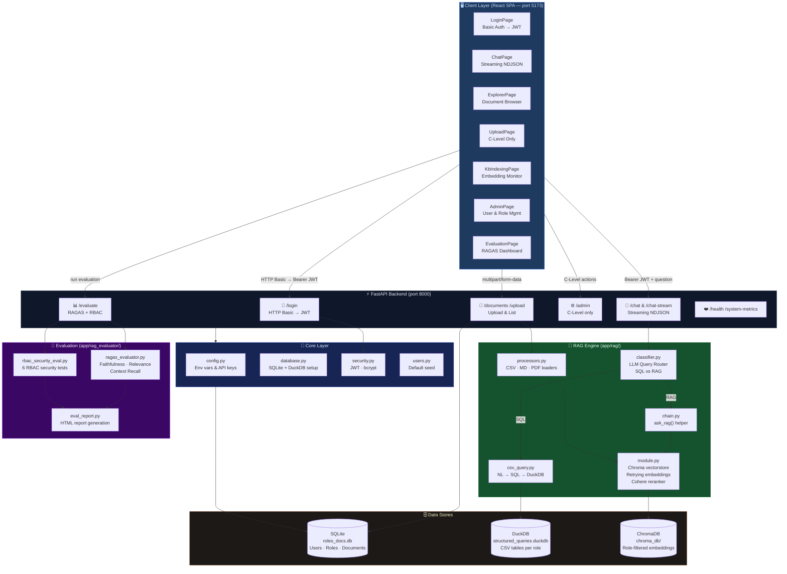
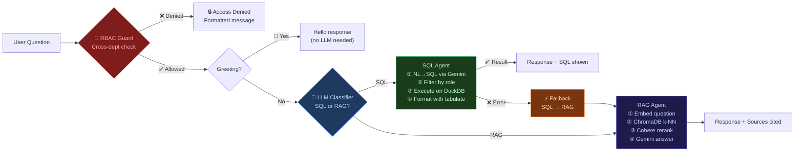
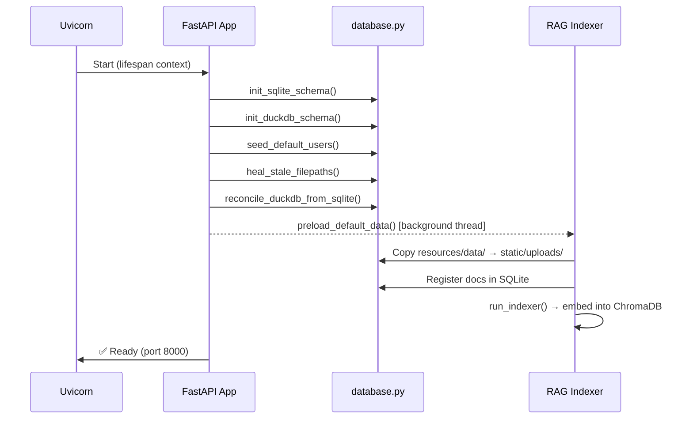

<div align="center">

# 🔍 FinSight

### Enterprise AI Workspace with Role-Based Access Control

*Intelligent document Q&A · SQL analytics · Multi-department security · RAG evaluation*

[](https://python.org)
[](https://fastapi.tiangolo.com)
[](https://react.dev)
[](https://www.typescriptlang.org)
[](https://vite.dev)
[](https://langchain.com)
[](https://deepmind.google/technologies/gemini/)
[](https://trychroma.com)
[](https://duckdb.org)
[](LICENSE)

</div>

---

## 📋 Table of Contents

- [Overview](#-overview)
- [Business Problem](#-business-problem)
- [System Architecture](#-system-architecture)
- [Request Lifecycle](#-request-lifecycle)
- [Key Features](#-key-features)
- [Tech Stack](#-tech-stack)
- [Project Structure](#-project-structure)
- [Database Schema](#-database-schema)
- [API Reference](#-api-reference)
- [Role & Permission Matrix](#-role--permission-matrix)
- [Quick Start](#-quick-start)
- [Configuration](#-configuration)
- [Default Credentials](#-default-credentials)
- [Testing](#-testing)
- [Evaluation Framework](#-evaluation-framework)
- [Sample Queries](#-sample-queries)
- [Future Enhancements](#-future-enhancements)

---

## 🧠 Overview

**FinSight** is a production-grade, role-based AI workspace built for enterprise environments. It combines **Retrieval-Augmented Generation (RAG)** for unstructured document Q&A with a **Natural Language → SQL** engine for structured CSV analytics — all behind a strict **JWT-authenticated, department-scoped access control layer**.

Users query their department's data in plain English. FinSight automatically classifies each question, routes it to the correct engine (RAG or SQL), and returns a grounded, source-cited response — while silently blocking any attempt to access another department's data.

> **Stack in one line:** React 19 SPA (Vite + TypeScript) → FastAPI → Gemini LLM + LangChain → ChromaDB (RAG) / DuckDB (SQL) → RAGAS evaluation

---

## 💼 Business Problem

FinSolve Technologies faced three interconnected challenges:

| Problem | Impact |
|---|---|
| **Siloed departmental data** — Finance, HR, Marketing, and Engineering each hoarded their own documents with no unified interface | Slow decision-making; leadership had no consolidated view |
| **Manual information retrieval** — analysts spent hours reading reports to find single data points | Productivity loss across all departments |
| **No access governance** — sensitive payroll, financial, and engineering IP were accessible to any authenticated employee | Data confidentiality and compliance risk |

FinSight solves all three: a single AI interface that delivers the right answer to the right person, and nothing more.

---

## 🏗 System Architecture

### High-Level Architecture


```mermaid
flowchart TD
    subgraph CLIENT["🖥️  Client Layer (React SPA — port 5173)"]
        LOGIN["LoginPage\nBasic Auth → JWT"]
        CHAT_UI["ChatPage\nStreaming NDJSON"]
        EXPLORER["ExplorerPage\nDocument Browser"]
        UPLOAD_UI["UploadPage\nC-Level Only"]
        KB["KbIndexingPage\nEmbedding Monitor"]
        ADMIN_UI["AdminPage\nUser & Role Mgmt"]
        EVAL_UI["EvaluationPage\nRAGAS Dashboard"]
    end

    subgraph FASTAPI["⚡  FastAPI Backend  (port 8000)"]
        AUTH["🔐 /login\nHTTP Basic → JWT"]
        CHAT["💬 /chat  &  /chat-stream\nStreaming NDJSON"]
        DOCS["📄 /documents  /upload\nUpload & List"]
        ADMIN["⚙️ /admin\nC-Level only"]
        EVAL["📊 /evaluate\nRAGAS + RBAC"]
        HEALTH["❤️ /health  /system-metrics"]
    end

    subgraph CORE["🧱  Core Layer"]
        CFG["config.py\nEnv vars & API keys"]
        DB["database.py\nSQLite + DuckDB setup"]
        SEC["security.py\nJWT · bcrypt"]
        USR["users.py\nDefault seed"]
    end

    subgraph RAG_ENGINE["🤖  RAG Engine  (app/rag/)"]
        CLS["classifier.py\nLLM Query Router\nSQL vs RAG"]
        PROC["processors.py\nCSV · MD · PDF loaders"]
        MOD["module.py\nChroma vectorstore\nRetrying embeddings\nCohere reranker"]
        CHN["chain.py\nask_rag() helper"]
        CSV["csv_query.py\nNL → SQL → DuckDB"]
    end

    subgraph STORES["🗄️  Data Stores"]
        SQLITE[("SQLite\nroles_docs.db\nUsers · Roles · Documents")]
        DUCK[("DuckDB\nstructured_queries.duckdb\nCSV tables per role")]
        CHROMA[("ChromaDB\nchroma_db/\nRole-filtered embeddings")]
    end

    subgraph EVAL_PKG["🧪  Evaluation  (app/rag_evaluator/)"]
        RAGAS["ragas_evaluator.py\nFaithfulness · Relevance\nContext Recall"]
        RBAC_TEST["rbac_security_eval.py\n6 RBAC security tests"]
        RPT["eval_report.py\nHTML report generation"]
    end

    CLIENT -- "HTTP Basic → Bearer JWT" --> AUTH
    CLIENT -- "Bearer JWT + question" --> CHAT
    CLIENT -- "multipart/form-data" --> DOCS
    CLIENT -- "C-Level actions" --> ADMIN
    CLIENT -- "run evaluation" --> EVAL

    AUTH --> SEC
    CHAT --> CLS
    CLS -- SQL --> CSV
    CLS -- RAG --> CHN
    CSV --> DUCK
    CHN --> MOD
    MOD --> CHROMA

    FASTAPI --> CORE
    CORE --> SQLITE
    DOCS --> SQLITE
    DOCS --> PROC
    PROC --> MOD

    EVAL --> RAGAS
    EVAL --> RBAC_TEST
    RAGAS --> RPT
    RBAC_TEST --> RPT

    style CLIENT fill:#1e3a5f,color:#bfdbfe,stroke:#2563eb
    style FASTAPI fill:#0f172a,color:#e2e8f0,stroke:#334155
    style CORE fill:#172554,color:#dbeafe,stroke:#1e40af
    style RAG_ENGINE fill:#14532d,color:#dcfce7,stroke:#166534
    style STORES fill:#1c1917,color:#fef3c7,stroke:#78350f
    style EVAL_PKG fill:#3b0764,color:#f3e8ff,stroke:#7e22ce
```

---

### Query Routing Flow


```mermaid
flowchart LR
    Q["User Question"] --> GUARD{"🔐 RBAC Guard\nCross-dept check"}

    GUARD -- "❌ Denied" --> DENY["🔒 Access Denied\nFormatted message"]
    GUARD -- "✅ Allowed" --> GREET{"Greeting?"}

    GREET -- "👋 Yes" --> HELLO["Hello response\n(no LLM needed)"]
    GREET -- "No" --> CLS{"🧠 LLM Classifier\nSQL or RAG?"}

    CLS -- SQL --> SQLAGENT["SQL Agent\n① NL→SQL via Gemini\n② Filter by role\n③ Execute on DuckDB\n④ Format with tabulate"]
    CLS -- RAG --> RAGAGENT["RAG Agent\n① Embed question\n② ChromaDB k-NN\n③ Cohere rerank\n④ Gemini answer"]

    SQLAGENT -- "✅ Result" --> RESP["Response + SQL shown"]
    SQLAGENT -- "❌ Error" --> FALLBACK["⚡ Fallback\nSQL → RAG"]
    FALLBACK --> RAGAGENT
    RAGAGENT --> RESP2["Response + Sources cited"]

    style GUARD fill:#7f1d1d,color:#fca5a5,stroke:#991b1b
    style CLS fill:#1e3a5f,color:#bfdbfe,stroke:#2563eb
    style SQLAGENT fill:#1a3c1a,color:#bbf7d0,stroke:#16a34a
    style RAGAGENT fill:#1e1b4b,color:#c7d2fe,stroke:#4338ca
    style FALLBACK fill:#78350f,color:#fed7aa,stroke:#ea580c
```

---

### Startup Lifecycle


```mermaid
sequenceDiagram
    participant UV as Uvicorn
    participant APP as FastAPI App
    participant DB as database.py
    participant IDX as RAG Indexer

    UV->>APP: Start (lifespan context)
    APP->>DB: init_sqlite_schema()
    APP->>DB: init_duckdb_schema()
    APP->>DB: seed_default_users()
    APP->>DB: heal_stale_filepaths()
    APP->>DB: reconcile_duckdb_from_sqlite()
    APP-->>IDX: preload_default_data() [background thread]
    IDX->>DB: Copy resources/data/ → static/uploads/
    IDX->>DB: Register docs in SQLite
    IDX->>IDX: run_indexer() → embed into ChromaDB
    APP->>UV: ✅ Ready (port 8000)
```

---

## 🔄 Request Lifecycle

A complete chat request from browser to response:

```
Browser ──► React SPA (5173) ──► POST /chat-stream (8000)
                                          │
                                    [Bearer JWT validated]
                                          │
                               ┌──────────▼──────────┐
                               │   RBAC Guard         │ ← Cross-dept keyword scan
                               └──────────┬──────────┘
                                          │
                               ┌──────────▼──────────┐
                               │   Query Classifier   │ ← Gemini LLM: "SQL" | "RAG"
                               └───────┬──────┬───────┘
                                    SQL│      │RAG
                           ┌──────────▼┐    ┌▼──────────────┐
                           │ NL→SQL    │    │ Embed question │
                           │ (Gemini)  │    │ (gemini-embedding-2-preview) │
                           └──────┬────┘    └──────┬─────────┘
                                  │                │
                           ┌──────▼────┐    ┌──────▼─────────┐
                           │ DuckDB    │    │ ChromaDB k=8   │
                           │ (role-    │    │ (role-filtered)│
                           │  filtered)│    └──────┬─────────┘
                           └──────┬────┘           │
                                  │         ┌──────▼─────────┐
                                  │         │ Cohere Rerank  │ (optional)
                                  │         └──────┬─────────┘
                                  │                │
                                  │         ┌──────▼─────────┐
                                  │         │ Gemini Answer  │
                                  │         └──────┬─────────┘
                                  │                │
                           ┌──────▼────────────────▼──┐
                           │  NDJSON stream → Browser  │
                           └───────────────────────────┘
```

---

## ✨ Key Features

### 🔐 1. Role-Based Access Control (RBAC)

- **JWT authentication** (HS256, 12-hour expiry) issued at `/login` via HTTP Basic Auth
- **Department isolation**: every document is tagged with a role; ChromaDB filters embeddings at query time using metadata
- **Cross-department guard**: a phrase-pattern scanner blocks `HR` users from querying Finance data, etc., *before* any LLM call
- **C-Level override**: the `c-level` role bypasses all department restrictions and gains access to all management pages

### 🖥️ 2. Modern React SPA Frontend

The frontend is a **React 19 + TypeScript** single-page application built with **Vite 8**, featuring:

| Page | Route | Access | Description |
|------|-------|--------|-------------|
| **Login** | `/login` | Public | HTTP Basic Auth form → JWT session via Zustand + sessionStorage |
| **AI Chat** | `/chat` | All roles | Real-time streaming chat with mode badges, copy-to-clipboard, source citations, and SQL display |
| **Explorer** | `/explorer` | All roles | Browse and search accessible department documents |
| **Upload Docs** | `/upload` | C-Level only | Drag-and-drop document upload with role assignment |
| **KB Indexing** | `/kb-indexing` | C-Level only | Live embedding progress dashboard with retry/reindex controls |
| **Admin Panel** | `/admin` | C-Level only | User and role management, system metrics |
| **Evaluation** | `/evaluation` | C-Level only | RAGAS metric visualisation (Recharts bar charts) + RBAC security test runner |

**UI features:**
- Dark-mode glassmorphism design with CSS custom properties
- Role-coloured sidebar with real-time API health indicator (`/` ping every 15 s)
- Sidebar system metrics card (docs / users / roles / tables) refreshed every 30 s
- Animated streaming cursor and thinking indicator during LLM responses
- Markdown rendering via `react-markdown` + `remark-gfm`
- Automatic `401` → redirect to login via Axios interceptors

### 🤖 3. Intelligent Dual-Mode Query Routing

| Mode | Trigger | Engine | Example |
|------|---------|--------|---------|
| **RAG** | "summarize", "explain", policy questions | Chroma + Gemini | *"Summarize the HR onboarding policy"* |
| **SQL** | "show", "list", "count", numeric filters | DuckDB + Gemini | *"List employees with salary > 80,000"* |
| **Greeting** | greetings, small-talk | Inline response | *"Hello!"* |
| **Fallback** | SQL fails / empty result | SQL → RAG | Automatic, transparent |

The **LLM classifier** (`app/rag/classifier.py`) uses a zero-shot Gemini prompt with hand-crafted disambiguation rules.

### ⚡ 4. Streaming Responses

`POST /chat-stream` returns **NDJSON** chunks in real time so the React UI can progressively render the answer — no waiting for the full response:

```json
{"type": "init",     "user": "alice", "role": "Finance", "mode": "RAG"}
{"type": "token",    "content": "The gross margin for 2024..."}
{"type": "token",    "content": " was 42.3%, an increase..."}
{"type": "metadata", "sources": ["finance_report_2024.md"], "fallback": false}
```

### 🗄️ 5. Dual Database Architecture

| Database | Technology | Purpose |
|----------|-----------|---------| 
| **Metadata store** | SQLite (WAL mode) | Users, roles, document registry, chunk counters |
| **Structured queries** | DuckDB (in-process) | One table per uploaded CSV, role-scoped |
| **Vector store** | ChromaDB | Embeddings for unstructured doc retrieval |

DuckDB tables are auto-created on CSV upload and reconciled from SQLite on every startup (`reconcile_duckdb_from_sqlite`). A `heal_stale_filepaths()` routine corrects absolute paths when the project folder is renamed or moved.

### 📊 6. Document Processing Pipeline

Supports three file types with dedicated loading strategies (Strategy pattern):

| File Type | Loader | Chunking Strategy |
|-----------|--------|-------------------|
| `.csv` | `CSVDocumentLoader` | Single document (full CSV as text) |
| `.md` | `MarkdownDocumentLoader` | `RecursiveCharacterTextSplitter` |
| `.pdf` | `PDFDocumentLoader` (pdfplumber) | Page-level + text splitter |

All chunks are tagged with `role`, `source`, and `filepath` metadata for retrieval filtering.

### 🔁 7. Production-Grade Embedding with Smart Retry

`RetryingEmbeddings` wraps `GoogleGenerativeAIEmbeddings` with:
- **Transient 429** → reads `retry_delay` from the error proto, waits, retries up to 10×
- **Hard quota** → raises immediately; the failing document is marked `embedded=-1` in SQLite
- **Exponential back-off** capped at 120 s

### 🏆 8. Cohere Reranker

When `COHERE_API_KEY` is set, the RAG pipeline upgrades from a simple top-8 vector search to a two-stage retrieve-then-rerank approach, dramatically reducing irrelevant context passed to the LLM.

### 🛡️ 9. Comprehensive Evaluation Suite

Two independent evaluation tracks run via `POST /evaluate` (C-Level only):

**Quality Evaluation (RAGAS)**
- Faithfulness, Answer Relevancy, Context Recall, Context Precision
- Synthetic QA pairs generated per role from live documents
- Results visualised in the **Evaluation** page with interactive bar charts (Recharts)
- Persisted as CSV + HTML report

**RBAC Security Evaluation** — six automated tests verify the access control layer:

| Test | What it checks |
|------|---------------|
| `test_unauthorized_access_blocked` | Role A cannot retrieve Role B documents |
| `test_authorized_access_allowed` | Role A can retrieve its own documents |
| `test_clevel_sees_all` | C-Level retrieves cross-department docs |
| `test_general_docs_accessible_to_all` | General docs are reachable by every role |
| `test_retriever_filter_correctness` | ChromaDB metadata filter is correctly applied |
| `test_authorization_leakage_score` | Cross-role context precision ≈ 0 (RAGAS) |

### 🧪 10. Automated Testing

- **Backend**: `pytest` with `TestClient` — classifier routing, SQL execution, RAG fallback, RBAC denial
- **E2E Frontend**: `Playwright` — login, tab rendering, document upload, query flow
- **Video recording** of Playwright sessions saved to `videos/`

---

## 🛠 Tech Stack

### Backend

| Layer | Technology | Version |
|-------|-----------|---------|
| **LLM** | Google Gemini (2.5 Flash / Pro, fallback chain) | `google-genai ≥1.64` |
| **Orchestration** | LangChain + LangChain-Chroma | `≥0.3.28` |
| **Embeddings** | `gemini-embedding-2-preview` (Google) | via `langchain-google-genai ≥2.1.3` |
| **Reranker** | Cohere Rerank v3 | `langchain-cohere ≥0.3.5` |
| **Vector DB** | ChromaDB | `≥0.5.23` |
| **SQL Engine** | DuckDB | `≥1.3.2` (in-process) |
| **Metadata DB** | SQLite (WAL mode) | stdlib |
| **Web Framework** | FastAPI + Uvicorn | `≥0.129` |
| **Auth** | JWT (PyJWT ≥2.11) + bcrypt (≥4.3) | HS256 · 12 h expiry |
| **Evaluation** | RAGAS | `≥0.4.3` |
| **PDF parsing** | pdfplumber | `≥0.11.9` |
| **Data** | Pandas · DuckDB · Tabulate | latest |
| **Testing** | Pytest · Playwright · pytest-playwright | latest |

### Frontend

| Layer | Technology | Version |
|-------|-----------|---------|
| **Framework** | React | `19.x` |
| **Language** | TypeScript | `~6.0` |
| **Build tool** | Vite | `^8.1` |
| **Router** | React Router DOM | `^7.18` |
| **State Management** | Zustand (persist → sessionStorage) | `^5.0` |
| **HTTP Client** | Axios | `^1.18` |
| **Icons** | Lucide React | `^1.24` |
| **Charts** | Recharts | `^3.9` |
| **Markdown** | react-markdown + remark-gfm | `^10.1 / ^4.0` |
| **Linting** | oxlint | `^1.71` |

---

## 📁 Project Structure

```
finsight/
├── app/
│   ├── main.py                         # FastAPI app factory & lifespan
│   │
│   ├── api/                            # HTTP layer — one file per domain
│   │   ├── auth.py                     # GET  /login  →  JWT issuance
│   │   ├── chat.py                     # POST /chat  &  /chat-stream
│   │   ├── documents.py                # POST /upload, GET /documents
│   │   ├── admin.py                    # User/role mgmt, reindex, system-metrics (C-Level)
│   │   ├── evaluate.py                 # POST /evaluate, GET /evaluate/status|report
│   │   └── health.py                   # GET  /health
│   │
│   ├── core/                           # Shared infrastructure
│   │   ├── config.py                   # Env vars, paths, Gemini fallback list, CORS origins
│   │   ├── database.py                 # SQLite + DuckDB init, heal, reconcile, preload
│   │   ├── security.py                 # JWT encode/decode, bcrypt hash/verify
│   │   └── users.py                    # Default user & role seeding
│   │
│   ├── rag/                            # RAG + SQL engine
│   │   ├── module.py                   # Chroma vectorstore, indexer, singleton, RetryingEmbeddings
│   │   ├── chain.py                    # ask_rag() high-level helper
│   │   ├── classifier.py               # LLM query router (SQL vs RAG)
│   │   ├── csv_query.py                # NL → SQL → DuckDB pipeline
│   │   ├── processors.py               # CSV / MD / PDF loader strategies
│   │   └── config.py                   # RAG-specific env setup
│   │
│   ├── rag_evaluator/                  # Evaluation framework
│   │   ├── ragas_evaluator.py          # RAGAS quality metrics runner (LLM-as-judge)
│   │   ├── no_llm_evaluator.py         # Quota-free embedding + statistical evaluator
│   │   ├── rbac_security_eval.py       # 6 RBAC security tests
│   │   ├── eval_dataset.py             # Synthetic QA pair generation & loader
│   │   ├── eval_report.py              # HTML report builder
│   │   ├── evaluation_results_no_llm.csv # Evaluated results (no-LLM metrics)
│   │   ├── evaluation_results_ragas_quick.csv # Quick RAGAS results
│   │   └── qa_pairs_openai.csv         # Curated evaluation dataset
│   │
├── frontend/                           # React 19 + TypeScript SPA (Vite)
│   ├── index.html
│   ├── vite.config.ts
│   ├── package.json
│   ├── .env.example                    # Frontend environment template
│   ├── tsconfig.app.json
│   └── src/
│       ├── main.tsx                    # React DOM entry point
│       ├── App.tsx                     # BrowserRouter + route definitions + auth guards
│       ├── index.css                   # Global design system (CSS custom properties, utilities)
│       ├── App.css
│       │
│       ├── api/
│       │   ├── client.ts               # Axios instance + Bearer-token & 401 interceptors
│       │   └── chat.ts                 # streamChat() — fetch-based NDJSON reader
│       │
│       ├── store/
│       │   └── authStore.ts            # Zustand auth store (persisted to sessionStorage)
│       │
│       ├── types/
│       │   └── index.ts                # Shared TypeScript interfaces
│       │
│       ├── components/
│       │   └── layout/
│       │       ├── AppLayout.tsx       # Shell wrapper (Sidebar + page outlet)
│       │       └── Sidebar.tsx         # Role-aware nav, user card, metrics, API health
│       │
│       └── pages/
│           ├── LoginPage.tsx           # Auth form (Basic Auth → JWT)
│           ├── ChatPage.tsx            # Streaming AI chat with mode badges & source citations
│           ├── ExplorerPage.tsx        # Document browser (search + filter by role)
│           ├── UploadPage.tsx          # File upload with role assignment (C-Level)
│           ├── KbIndexingPage.tsx      # Embedding progress monitor + reindex controls
│           ├── AdminPage.tsx           # User & role management panel (C-Level)
│           └── EvaluationPage.tsx      # RAGAS metrics (bar charts) + RBAC tests (C-Level)
│
├── resources/
│   └── data/                           # Seed documents (auto-loaded on startup)
│       ├── engineering/
│       ├── finance/
│       ├── general/
│       ├── hr/
│       └── marketing/
│
├── static/
│   ├── data/                           # DuckDB file + JWT secret key
│   ├── images/                         # UI assets
│   └── uploads/                        # Role-scoped document storage
│       ├── Engineering/
│       ├── Finance/
│       ├── General/
│       ├── HR/
│       └── Marketing/
│
├── tests/
│   ├── conftest.py
│   ├── test_chatbot.py                 # Backend API & RBAC tests (Pytest + TestClient)
│   ├── test_ragas_eval.py              # Evaluation pipeline & threshold tests
│   └── sample_docs/                    # Sample documents for isolated test runs
│
├── run_no_llm_evaluation.py            # Standalone fast quota-free evaluation CLI
├── run_full_ragas_evaluation.py         # Standalone full RAGAS evaluation CLI
├── back.bat                            # Windows: start FastAPI (port 8000)
├── front.bat                           # Windows: start React dev server (port 5173)
├── Dockerfile.backend                  # Dockerfile for FastAPI backend
├── Dockerfile.frontend                 # Dockerfile for React/Vite frontend
├── docker-compose.yml                  # Docker Compose configuration
├── .dockerignore                       # Exclude patterns for Docker builds
├── .env.example                        # Backend environment variable template
├── requirements.txt                    # Python dependencies (pinned ranges)
└── pyproject.toml                      # PEP 517 project metadata + pytest markers
```

---

## 🗃️ Database Schema

### SQLite (`roles_docs.db`)

```sql
CREATE TABLE users (
    id       INTEGER PRIMARY KEY AUTOINCREMENT,
    username TEXT UNIQUE,
    password TEXT,          -- bcrypt hash
    role     TEXT
);

CREATE TABLE roles (
    id        INTEGER PRIMARY KEY AUTOINCREMENT,
    role_name TEXT UNIQUE
);

CREATE TABLE documents (
    id               INTEGER PRIMARY KEY AUTOINCREMENT,
    filename         TEXT,
    role             TEXT,
    filepath         TEXT NOT NULL,   -- absolute, auto-healed on startup
    headers_str      TEXT,            -- CSV column names (NULL for non-CSV)
    embedded         INTEGER DEFAULT 0,  -- 0=pending, 1=indexed, -1=failed
    total_chunks     INTEGER DEFAULT 0,
    embedded_chunks  INTEGER DEFAULT 0
);
```

### DuckDB (`structured_queries.duckdb`)

```sql
-- Metadata registry (one row per CSV table)
CREATE TABLE tables_metadata (
    table_name TEXT,
    role       TEXT
);

-- Dynamic tables (one per uploaded CSV, named from filename stem)
-- e.g.:  employee_data,  finance_report_2024,  marketing_campaigns
CREATE TABLE <filename_stem> AS SELECT * FROM '<csv_path>';
```

---

## 📡 API Reference

| Method | Endpoint | Auth | Description |
|--------|----------|------|-------------|
| `GET` | `/health` | None | Health check |
| `GET` | `/login` | HTTP Basic | Returns JWT access token |
| `POST` | `/chat` | Bearer JWT | Synchronous chat response |
| `POST` | `/chat-stream` | Bearer JWT | NDJSON streaming response |
| `POST` | `/upload` | Bearer JWT | Upload document (MD, CSV, PDF) |
| `GET` | `/documents` | Bearer JWT | List accessible documents |
| `GET` | `/roles` | Bearer JWT | List all roles |
| `GET` | `/indexing-status` | Bearer JWT | Per-file embedding progress (upload bar) |
| `GET` | `/system-metrics` | C-Level JWT | Docs / users / roles / tables counts |
| `POST` | `/create-user` | C-Level JWT | Create a new user |
| `POST` | `/create-role` | C-Level JWT | Create a new role |
| `GET` | `/reindex-status` | C-Level JWT | Embedding progress summary |
| `GET` | `/reindex-details` | C-Level JWT | Per-document indexing status |
| `POST` | `/reindex` | C-Level JWT | Wipe & rebuild vector store |
| `POST` | `/reindex-retry` | C-Level JWT | Retry failed/pending documents |
| `GET` | `/indexing-status-bulk` | C-Level JWT | All docs status (admin dashboard) |
| `POST` | `/evaluate` | C-Level JWT | Run RAGAS + RBAC evaluation |
| `GET` | `/evaluate/status` | C-Level JWT | Last evaluation result |
| `GET` | `/evaluate/report` | C-Level JWT | Download HTML evaluation report |

**Interactive docs:** `http://localhost:8000/docs`

---

## 🔑 Role & Permission Matrix

| Role | Own Dept Docs | General Docs | All Dept Docs | Upload | Admin | Evaluate |
|------|:---:|:---:|:---:|:---:|:---:|:---:|
| **C-Level** | ✅ | ✅ | ✅ | ✅ | ✅ | ✅ |
| **Finance** | ✅ | ✅ | ❌ | ❌ | ❌ | ❌ |
| **HR** | ✅ | ✅ | ❌ | ❌ | ❌ | ❌ |
| **Marketing** | ✅ | ✅ | ❌ | ❌ | ❌ | ❌ |
| **Engineering** | ✅ | ✅ | ❌ | ❌ | ❌ | ❌ |
| **General** | ❌ | ✅ | ❌ | ❌ | ❌ | ❌ |

Cross-department access attempts return a formatted denial message — no data is leaked and no LLM call is made.

> **Frontend Route Guard:** C-Level-only pages (`/upload`, `/kb-indexing`, `/admin`, `/evaluation`) use a `CLevelRoute` guard component that redirects non-C-Level users to `/chat`.

---

## 🚀 Quick Start

### Prerequisites

- **Python 3.10+**
- **Node.js 18+** and **npm** (for the React frontend)
- A [Google Gemini API key](https://aistudio.google.com/app/apikey)
- *(Optional)* A [Cohere API key](https://dashboard.cohere.com/) for reranking

### 1. Clone the Repository

```bash
git clone https://github.com/your-org/finsight.git
cd finsight
```

### 2. Create a Python Virtual Environment

```bash
python -m venv .venv

# Windows
.venv\Scripts\activate

# macOS / Linux
source .venv/bin/activate
```

### 3. Install Python Dependencies

```bash
pip install -r requirements.txt
```

### 4. Install Frontend Dependencies

```bash
cd frontend
npm install
cd ..
```

### 5. Configure Environment Variables

```bash
cp .env.example .env
```

Edit `.env` and set at minimum:

```env
GOOGLE_API_KEY=your_google_gemini_api_key_here
```

### 6. Start the Application

**Option A — Docker Compose (Recommended - runs in containers):**

Ensure you have Docker and Docker Compose installed, then run:

```bash
docker compose up --build
```

This starts:
- The FastAPI backend container on port `8000` (auto-reloading on python file changes).
- The React/Vite frontend container on port `5173` (with hot-module reloading/HMR active).
- SQLite/DuckDB/ChromaDB databases are persisted on the host, so data persists when containers stop.

**Option B — Windows batch files (two separate terminals):**

```bat
back.bat    # Terminal 1 — starts FastAPI on port 8000
front.bat   # Terminal 2 — starts React dev server on port 5173
```

**Option C — Manual (two terminals):**

```bash
# Terminal 1 — FastAPI backend
python -m uvicorn app.main:app --host 127.0.0.1 --port 8000

# Terminal 2 — React frontend (Vite dev server)
cd frontend
npm run dev
```

### 7. Open the App

Navigate to **http://localhost:5173** and log in with any of the [default credentials](#-default-credentials) below.

> **First run:** FinSight automatically seeds the database, copies department documents from `resources/data/`, and begins embedding them in a background thread. The **KB Indexing** page shows real-time embedding progress.

---

## ⚙️ Configuration

All settings are loaded from environment variables (`.env`):

| Variable | Default | Description |
|----------|---------|-------------|
| `GOOGLE_API_KEY` | *required* | Google Gemini API key (also accepts `GEMINI_API_KEY`) |
| `COHERE_API_KEY` | *(empty)* | Enables Cohere reranking when set |
| `LANGCHAIN_API_KEY` | *(empty)* | LangSmith tracing (optional) |
| `DB_NAME` | `roles_docs.db` | SQLite filename |
| `DUCKDB_NAME` | `structured_queries.duckdb` | DuckDB filename |
| `JWT_SECRET` | *(auto-generated)* | JWT signing key; set for multi-server deploys |
| `ADMIN_PASSWORD` | `admin123` | C-Level admin password |
| `FINANCE_PASSWORD` | `finance123` | Finance user password |
| `HR_PASSWORD` | `hr123` | HR user password |
| `MARKETING_PASSWORD` | `marketing123` | Marketing user password |
| `ENGINEERING_PASSWORD` | `engineering123` | Engineering user password |

> ⚠️ **Change all default passwords before any production deployment.**

---

## 🔓 Default Credentials

| Username | Password | Role |
|----------|----------|------|
| `admin` | `admin123` | **C-Level** (full access) |
| `finance` | `finance123` | Finance |
| `hr` | `hr123` | HR |
| `marketing` | `marketing123` | Marketing |
| `engineering` | `engineering123` | Engineering |

---

## 🧪 Testing

FinSight includes comprehensive unit and integration test suites covering the backend API, RBAC security gates, and evaluation thresholds.

### 1. Backend API & RBAC Tests (Pytest)

Run all API, authentication, query classifier, and RBAC security tests:

```bash
pytest tests/test_chatbot.py -v
```

**Tests cover:**
- JWT authentication flow (issuance, expiration, and invalid token rejection)
- RBAC denial for cross-department queries (zero data leakage guarantee)
- Query classifier routing (SQL vs RAG vs Greetings)
- Natural language to SQL generation and DuckDB execution
- Document upload and indexing status

### 2. Evaluation Pipeline & Threshold Tests

```bash
# Run fast unit tests (no live API calls required):
pytest tests/test_ragas_eval.py -v -m "not slow"

# Run full test suite:
pytest -v
```

---

## 📈 Evaluation Framework

FinSight provides a robust, two-tier evaluation framework:

### 1. Quota-Free Fast Evaluation (`run_no_llm_evaluation.py`)

A zero-cost, lightning-fast evaluation runner that uses local mathematical and statistical metrics (Cosine similarity on Google embeddings, BM25 token overlap, and ROUGE-L sequence matching) without consuming LLM-as-judge API quota:

```bash
python run_no_llm_evaluation.py
```

| Metric | Computation Method | Description |
|--------|-------------------|-------------|
| **`context_recall`** | `cos_sim(mean(contexts), reference)` | Measures semantic recall of necessary context |
| **`answer_relevancy`** | `cos_sim(question, answer)` | Measures direct relevance of generated answer to question |
| **`context_precision`** | BM25 top chunk scoring | Evaluates signal-to-noise ratio in retrieved context |
| **`faithfulness_token`** | ROUGE-L token recall | Measures factual alignment of answer against context |
| **`answer_similarity`** | `cos_sim(answer, reference)` | Assesses semantic agreement with ground-truth reference |

### 2. Full RAGAS LLM-as-Judge Evaluation (`run_full_ragas_evaluation.py`)

Executes live RAG queries and evaluates answers using Gemini LLM-as-judge:

```bash
python run_full_ragas_evaluation.py
```

### 3. RBAC Security Test Suite

Evaluates access control integrity with 6 automated security tests:
1. `test_unauthorized_access_blocked`: Cross-department access attempts are blocked.
2. `test_authorized_access_allowed`: Department users can access their own department documents.
3. `test_clevel_sees_all`: C-Level administrators have cross-department visibility.
4. `test_general_docs_accessible_to_all`: General/company-wide docs are accessible to all roles.
5. `test_retriever_filter_correctness`: ChromaDB metadata filter enforces role boundaries.
6. `test_authorization_leakage_score`: RAGAS leakage score verification.

### 4. Interactive Web Evaluation Dashboard & HTML Reports

- **C-Level Evaluation Dashboard:** Navigate to `/evaluation` in the React UI to view real-time scorecards, interactive Recharts bar charts, and individual QA records.
- **HTML Report Export:** A comprehensive visual report is automatically compiled to `app/rag_evaluator/ragas_report.html` and downloadable via `GET /evaluate/report`.

---

## 💬 Sample Queries

Try these queries after logging in with the appropriate role:

| Role | Query | Expected Mode |
|------|-------|--------------|
| **HR** | `Give me the details of employees in the Data department with a performance rating of 5` | SQL |
| **HR** | `Summarize our employee onboarding policy` | RAG |
| **Finance** | `What was the percentage increase in net income in 2024?` | RAG |
| **Finance** | `Show me all vendor expenses greater than $50,000` | SQL |
| **Marketing** | `What is the ROI for our Q3 campaign?` | SQL/RAG |
| **Engineering** | `Give me a summary of the system architecture` | RAG |
| **C-Level** | `Compare Finance and Marketing budget allocations` | RAG |
| **General** | `What are the company leave policies?` | RAG |
| **Any** | `Hello!` | Greeting (no LLM) |
| **HR** *(attempting Finance)* | `What is our gross margin?` | 🔒 RBAC Denied |

---

## 🔮 Future Enhancements

- [ ] **Hybrid retrieval** — combine dense (Chroma) + sparse (BM25) for better recall
- [ ] **Multi-turn conversation memory** — maintain session context across queries
- [ ] **Admin analytics dashboard** — query type distribution, usage heatmaps per department
- [ ] **Table + text fusion** — answer questions that span both CSV data and document policies
- [ ] **SQL query caching** — LRU cache for repeated structured queries
- [ ] **OAuth 2.0 / SSO** — enterprise identity provider integration
- [ ] **Async indexer** — replace thread executor with a proper task queue (Celery/ARQ)
- [ ] **Multi-modal support** — extract data from images and charts in PDFs
- [ ] **Production build** — `npm run build` + FastAPI static file serving for single-server deployment

---

## 📄 License

This project is licensed under the **MIT License** — see the [LICENSE](LICENSE) file for details.

---

<div align="center">

Built with ❤️ for enterprise AI — **FinSight** by FinSolve Technologies

*Role-based intelligence. Zero data leakage. Production-ready.*

</div>
