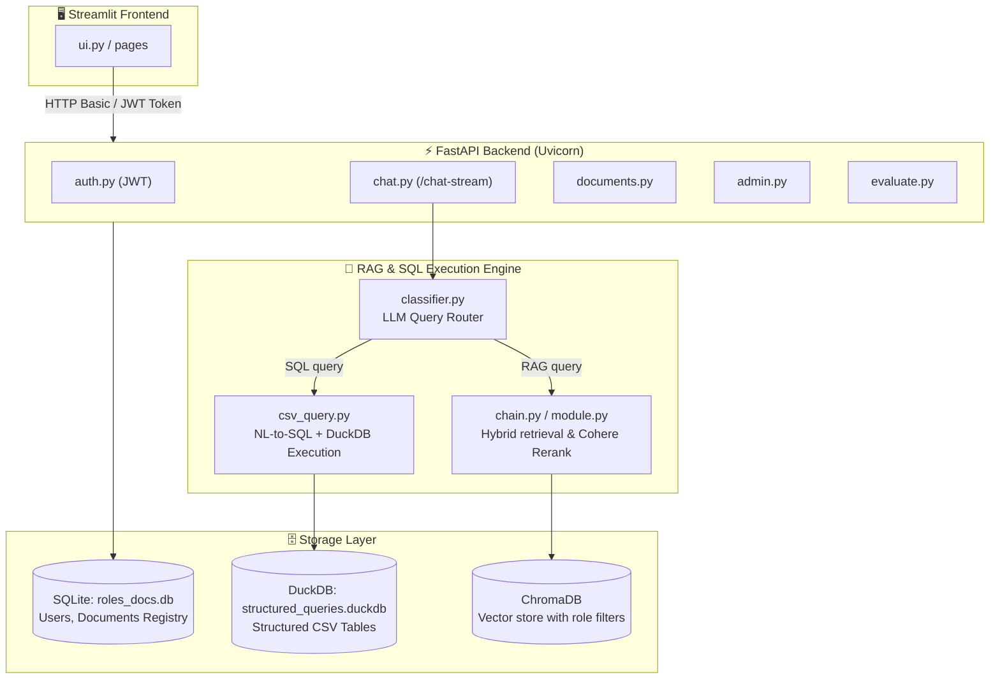

# 🔍 FinSight: Enterprise RAG & SQL Workspace
## Comprehensive Project Analysis, Architecture Rationale, and Enterprise Recruiter Prep Guide

This document provides a deep architectural and technical analysis of **FinSight**, a production-grade enterprise AI workspace. It explains the design choices, technology selections, project classification, and lists potential questions enterprise recruiters or system architects might ask, along with comprehensive answers referencing the codebase.

---

## 🏁 Executive Summary

**FinSight** is a multi-department, secure AI workspace that bridges the gap between unstructured document search and structured tabular analysis. It solves three critical business problems common in large enterprises:
1. **Data Silos**: HR, Finance, Engineering, and Marketing can search their respective document spaces from a unified interface.
2. **Information Discovery**: Replaces manual scanning of PDFs, Markdown guidelines, and Excel sheets with conversational Q&A.
3. **Access Governance (Security)**: Implements strict, cryptographically verified Role-Based Access Control (RBAC) to isolate sensitive documents, preventing unauthorized data leakage.

---

## 📈 Project Level: Production-Grade / Senior Backend & AI Engineer

FinSight is classified as an **Advanced, Production-Grade** project. It is far beyond a simple "toy" or "tutorial-level" RAG prototype. The technical features that justify this classification include:

* **Robust Identity and Token-Based Security**: It does not rely on a mock UI selector for users. It implements true **JWT authentication (HS256)** via FastAPI backend middleware, validating HTTP Authorization headers (`Bearer <Token>`) and password hashing using `bcrypt`.
* **State and Storage Separations (Triple-DB System)**: It utilizes three database engines tailored to their strengths: SQLite (metadata/registry), DuckDB (analytical querying on CSVs), and ChromaDB (vector embeddings).
* **Self-Healing Design (Resiliency)**: The database initialization routines include path-healing logic (`heal_stale_filepaths()`) to automatically update absolute file system links if the codebase is moved.
* **API Resiliency (Rate-Limit and Quota Management)**: It features custom wrapper logic (`RetryingEmbeddings`) that differentiates between transient rate limits (HTTP 429) and hard quota limits, executing back-off and retry logic based on headers.
* **Background Queue Processing**: It uses a dedicated, non-blocking producer-consumer thread queue for document parsing, chunking, and embedding.
* **Quantitative Quality Gates (RAGAS)**: It includes an automated evaluation suite checking Faithfulness, Answer Relevancy, Context Precision, and Context Recall using LLM-as-a-judge.
* **Security Penetration Testing**: It contains an automated security evaluator (`rbac_security_eval.py`) that tests 6 distinct security scenarios, producing numerical vulnerability and leakage scores.

---

## 🏗️ System Architecture: Why We Made These Design Choices



### 1. Separation of Structured & Unstructured Queries
Standard RAG pipelines often struggle with structured data (e.g., trying to search for "list employees with salary > $80,000" inside raw text files). FinSight uses a **Dual-Mode Query Router** (`app/rag/classifier.py`):
* **Unstructured requests** (e.g., policies, summaries) are routed to a dense-vector retrieval chain (ChromaDB + Gemini).
* **Structured requests** (e.g., counts, limits, tables) are routed to a text-to-SQL translation agent that executes queries directly on a local **DuckDB** instance.
* **SQL Fallback to RAG**: If a query is classified as SQL but fails syntax checks, columns mismatch, or returns empty results, it automatically falls back to the RAG engine, ensuring user-facing resiliency.

### 2. Multi-DB Topology (SQLite, DuckDB, ChromaDB)
Using a single database for everything leads to performance bottlenecks and high architectural complexity:
* **SQLite**: Selected for storing lightweight, transactional, relational data (user credentials, roles, indexing statuses, and document paths). Its WAL (Write-Ahead Logging) mode is activated to prevent lockouts during concurrent background writes.
* **DuckDB**: Selected for structured file analysis. DuckDB is an in-process, columnar database optimized for analytical queries (OLAP). It allows loading CSV files dynamically on demand (`CREATE TABLE <stem> AS SELECT * FROM '<csv>'`) and executing fast SQL computations directly.
* **ChromaDB**: Selected as the vector store because of its lightweight, local persistence, clean integration with LangChain, and support for metadata filtering.

### 3. Decoupled Frontend/Backend Architecture
By separating the UI (Streamlit) from the Backend (FastAPI), the application is modular:
* **Streamlit** is used solely as a presentation and rendering layer.
* **FastAPI** handles authentication, authorization, database coordination, background tasks, and streaming. This allows swapping the Streamlit UI for a React, Vue, or mobile interface without rewriting any core AI, SQL, or security logic.
* FastAPI's async capabilities enable **Streaming NDJSON responses** (`POST /chat-stream`), permitting token-by-token generation in the UI and minimizing perceived latency.

### 4. Background Indexing Worker
Converting files to vector embeddings is CPU and network intensive (API calls to Gemini). If run inside HTTP request handlers, it causes client timeouts. FinSight uses a **Producer-Consumer Queue pattern** with a dedicated background worker thread (`start_indexer_worker()` inside `app/rag/module.py`), decoupling document uploads from indexing completion.

---

## 🛠️ Tool & Feature Deep-Dive

### 1. Google Gemini 2.5 Flash & 3.1 Flash-Lite
* **Choice**: Gemini was selected for its cost-efficiency, high speed, and massive context limits.
* **Fallback Chain**: The orchestration setup includes a fallback chain:
  ```python
  model = ChatGoogleGenerativeAI(
      model="gemini-2.5-flash",
      temperature=0.2,
      ...
  ).with_fallbacks([
      ChatGoogleGenerativeAI(model="gemini-3.1-flash-lite", temperature=0.2, ...)
  ])
  ```
  If the primary model hits transient Google API errors or regional outages, the request automatically falls back to `gemini-3.1-flash-lite`, preventing service interruption.

### 2. Custom Rate-Limit and Quota Resiliency (`RetryingEmbeddings`)
Standard LangChain wrappers fail immediately when hitting Google API limits (HTTP 429 / Resource Exhausted).
FinSight defines a custom embedding wrapper `RetryingEmbeddings` subclassing `GoogleGenerativeAIEmbeddings` that:
1. Classifies errors as **transient rate limits** (e.g., standard 429) or **hard quotas** (e.g., billing exhausted).
2. Parses Google's API proto headers to extract the exact `retry_delay` seconds.
3. Automatically sleeps and retries up to 10 times with exponential backoff.
4. If a **hard quota** limit is reached, it halts embedding for the affected document and marks it `embedded = -1` in SQLite. Other document imports remain unaffected.

### 3. Strategy Pattern for Multi-Format Chunking
The ingestion pipeline implements a clean Strategy pattern (`app/rag/processors.py`):
* `DocumentLoaderFactory` and `ChunkerFactory` instantiate format-specific classes (`CSVSemanticChunker`, `MarkdownSemanticChunker`, `PDFSemanticChunker`) based on file extension.
* Instead of uniform text splitting, documents are chunked semantically:
  * **Markdown** is split using headers as logical boundaries, and the full header path (e.g., `Governance > Security > Audits`) is prepended to each chunk for context preservation.
  * **PDFs** are parsed page-by-page using `pdfplumber` to retain physical location references.
  * **CSVs** are batched into rows and augmented with column metadata so structural relationships are not lost when embedded.

### 4. Cohere Rerank v3 (Two-Stage Retrieval)
Embedding models are good at broad semantic matching but poor at calculating precise relevancy. FinSight implements **two-stage retrieval**:
1. **Stage 1 (Vector Search)**: ChromaDB returns the top 30 candidate chunks.
2. **Stage 2 (Semantic Reranking)**: Cohere's `rerank-english-v3.0` model evaluates the candidates relative to the query, selecting the top 6 most relevant chunks. This reduces LLM context noise and tokens consumption.

### 5. Multi-Layer Role-Based Access Control (RBAC)
Security in AI systems must be multi-layered:
1. **Pre-LLM Access Guard (`check_cross_dept_access`)**: Scans user questions for department-specific keywords (e.g., a Marketing user searching for "payroll" or "gross margin"). If a violation is found, it raises an instant denial, preventing unnecessary LLM and database costs.
2. **Database Metadata Filter**: When queries pass the keyword scan, RAG queries execute with a metadata filter on ChromaDB matching the user's role (e.g., `{"role": {"$in": ["finance", "general"]}}`). SQL queries query DuckDB, which restricts tables using role mappings:
   ```python
   # Only returns table names the role is authorized to read
   allowed_tables = get_allowed_tables_for_role(role)
   ```

---

## 🔒 Enterprise Recruiter Interview Q&A Prep

This section details technical questions that recruiters, tech leads, or system architects from major enterprises might ask you during interviews, along with professional answers based on FinSight's codebase.

### Q1: "How does your RAG system handle document security and role-based access control? How do you prevent data leakage?"
> **Code references:** [chat.py](file:///c:/Users/Hamza%20Ali/Desktop/Finsight_05/app/api/chat.py#L88-L124), [csv_query.py](file:///c:/Users/Hamza%20Ali/Desktop/Finsight_05/app/rag/csv_query.py#L29-L53), [module.py](file:///c:/Users/Hamza%20Ali/Desktop/Finsight_05/app/rag/module.py#L470-L474)

**Answer:**
"FinSight implements **security-in-depth** across three layers:
1. **Pre-LLM Guardrail**: A keyword and phrase scanner scans questions for department indicators (`_DEPT_PHRASES`). If a user with the `Marketing` role asks for a `Finance` keyword, they are blocked immediately before contacting the vector database or LLM.
2. **Vector DB Metadata Isolation**: At retrieval time, the user's role is extracted from their verified JWT token. The custom `HybridMultiQueryRetriever` builds a strict metadata query filter (e.g., `{"role": {"$in": ["finance", "general"]}}`). ChromaDB is forced to search only the authorized chunk subset. Even if a user attempts prompt injection to bypass the system prompt, they physically cannot access other departments' vectors because they are filtered out at the DB level.
3. **Structured Table Restriction**: For structured SQL queries, the system matches requested table names against metadata in DuckDB. Only tables matching the user's role or 'general' are queryable. C-Level roles bypass these restrictions to query across departments."

---

### Q2: "Why did you choose DuckDB alongside ChromaDB? Why not use pgvector in PostgreSQL for both?"
> **Code references:** [database.py](file:///c:/Users/Hamza%20Ali/Desktop/Finsight_05/app/core/database.py#L150-L191), [csv_query.py](file:///c:/Users/Hamza%20Ali/Desktop/Finsight_05/app/rag/csv_query.py#L192-L197)

**Answer:**
"While `pgvector` is a strong option for consolidated enterprise storage, using separate databases for structured and unstructured analysis allows us to choose the best tool for the job:
* **Vector Search vs Analytical SQL**: Structured data analysis (aggregations, counts, numeric filters) is poor when performed inside a vector database. By using **DuckDB**, we run standard SQL SELECT statements on tables generated dynamically from uploaded CSV files. DuckDB is an in-process columnar database, meaning it performs OLAP calculations on data structures locally without database network roundtrips.
* **Separation of Concerns**: Unstructured documents (PDFs, Markdown) are stored in **ChromaDB**, which excels at k-NN semantic searches.
* **Data Flow**: SQLite acts as our main configuration/user registry. On startup, the system synchronizes SQLite schema rows with DuckDB tables via a reconciliation engine (`reconcile_duckdb_from_sqlite`). This approach provides high performance without the overhead of maintaining a database server in development and staging."

---

### Q3: "Explain how you handle LLM rate limits and API failures when indexing documents in the background. What happens if you hit a hard quota?"
> **Code references:** [module.py](file:///c:/Users/Hamza%20Ali/Desktop/Finsight_05/app/rag/module.py#L50-L123), [module.py](file:///c:/Users/Hamza%20Ali/Desktop/Finsight_05/app/rag/module.py#L349-L356)

**Answer:**
"We built a custom subclass `RetryingEmbeddings` that wraps LangChain’s Google embedding interface.
* **Transient Error Recovery (429)**: The wrapper catches exceptions and classifies them. If a transient rate limit (HTTP 429) occurs, the code extracts the suggested retry delay directly from the Google API error proto response using regex:
  ```python
  proto_match = re.search(r"retry_delay\s*\{[^}]*seconds:\s*(\d+)", s, re.IGNORECASE | re.DOTALL)
  ```
  It sleeps for that duration and retries up to 10 times with exponential backoff.
* **Hard Quotas**: If a hard quota error (e.g. billing limit reached) is detected, it terminates the search immediately and marks only the currently failing document as `embedded = -1` in SQLite. The background worker is stopped, and other pending documents are left untouched. Administrators can resolve the billing issue and click the 'Retry Failed' button, which updates `-1` documents back to `0` and restarts the background thread loop."

---

### Q4: "How does the Natural Language-to-SQL translation process work? How do you prevent SQL injection?"
> **Code references:** [csv_query.py](file:///c:/Users/Hamza%20Ali/Desktop/Finsight_05/app/rag/csv_query.py#L55-L70), [csv_query.py](file:///c:/Users/Hamza%20Ali/Desktop/Finsight_05/app/rag/csv_query.py#L157-L190)

**Answer:**
"The Natural Language to SQL pipeline operates in three phases:
1. **Schema Presentation**: The LLM prompt is populated with schemas of the user's authorized tables retrieved from SQLite. Column structures and names are provided to the LLM.
2. **Translation**: Gemini translates the natural language query into a standard SQL SELECT statement, using casting (`CAST(col AS DOUBLE)`) to prevent DuckDB binder errors on numeric fields stored as strings.
3. **Execution & Security Validation**: Before running the query against DuckDB, it passes through security checks:
   * **Write Isolation**: The query is validated using `is_safe_query()` to ensure it starts with `SELECT` and does not contain modification keywords (`INSERT`, `UPDATE`, `DELETE`, `DROP`, `ALTER`, `CREATE`).
   * **Table Scope Verification**: The query is parsed using regex to extract all table names referenced in `FROM` or `JOIN` statements. The table names are checked against `get_allowed_tables_for_role(role)`. If any table name is malformed or unauthorized, execution is blocked.
   * **Read-Only Connections**: The database connection is established in read-only mode:
     ```python
     d_conn = duckdb.connect(_DUCKDB_FILE, read_only=True)
     ```
     This prevents data modification even if a malicious payload gets past the regex validators."

---

### Q5: "How do you evaluate your RAG system's answer quality? What metrics do you track, and how do you run them in production?"
> **Code references:** [ragas_evaluator.py](file:///c:/Users/Hamza%20Ali/Desktop/Finsight_05/app/rag_evaluator/ragas_evaluator.py#L10-L24), [ragas_evaluator.py](file:///c:/Users/Hamza%20Ali/Desktop/Finsight_05/app/rag_evaluator/ragas_evaluator.py#L110-L207)

**Answer:**
"We integrated the **RAGAS framework** directly into our administration API and dashboard, using Gemini as our evaluation engine. We track five quality metrics:
* **Faithfulness**: Verifies if the generated answer is strictly grounded in the retrieved context (hallucination detection).
* **Answer Relevancy**: Measures how well the answer addresses the user's question.
* **Context Precision**: Evaluates whether retrieved document chunks are ordered by relevance.
* **LLM Context Recall**: Checks if the retrieved context contains all necessary facts from a reference 'ground truth'.
* **Answer Correctness**: Compares the final answer against ground-truth data for semantic similarity and factual agreement.

We set up production quality gates with specific warn/pass thresholds (e.g. 0.75 for faithfulness). We also built a **Security Evaluation** suite (`rbac_security_eval.py`) that tests access control limits. It runs queries on unauthorized roles to ensure context precision is exactly `0` (which is desirable for security, indicating no data was leaked)."

---

### Q6: "Why did you build your own document loading and chunking system instead of using LangChain's default load-and-split methods?"
> **Code references:** [processors.py](file:///c:/Users/Hamza%20Ali/Desktop/Finsight_05/app/rag/processors.py#L165-L239), [processors.py](file:///c:/Users/Hamza%20Ali/Desktop/Finsight_05/app/rag/processors.py#L106-L162)

**Answer:**
"Standard LangChain splits text based solely on character count and overlap. This often breaks markdown tables, splits paragraphs mid-sentence, and separates structural metadata. We implemented the Strategy pattern to apply format-specific chunking:
* **Markdown Semantic Chunker**: Parses files by their actual headers (`#` to `######`). For each heading block, it creates a text chunk and prepends the full header hierarchy (e.g., `Document: hr_handbook.md > Section: Health > Sub-section: Dental`). This ensures that even if a sub-chunk is retrieved in isolation, the LLM has the context of which heading it belongs to.
* **CSV Semantic Chunker**: CSV files are chunked by groups of rows, prepending column names as metadata for each line, and generating an LLM-powered summary chunk for the file. This allows semantic queries to find the dataset before querying it via SQL.
* **PDF Semantic Chunker**: Uses `pdfplumber` to extract page structures and numbers, keeping pages together and avoiding text splitting across page breaks."

---

### Q7: "What is your RAG system's query expansion strategy, and how does your retrieval system work?"
> **Code references:** [module.py](file:///c:/Users/Hamza%20Ali/Desktop/Finsight_05/app/rag/module.py#L437-L456), [module.py](file:///c:/Users/Hamza%20Ali/Desktop/Finsight_05/app/rag/module.py#L489-L550)

**Answer:**
"We implement a **Hybrid Multi-Query Retriever** inside LangChain:
1. **Query Expansion**: When a query is received, we call Gemini to generate 3 alternative variations of the query, capturing different semantic angles of the search.
2. **Concurrent Vector Retrieval**: We execute similarity searches across all 4 query variants in parallel using a `ThreadPoolExecutor`.
3. **Score Filtering & De-duplication**: Chunks matching the user's role are retrieved. Any chunk with a similarity score below 0.15 is discarded, and duplicates across query variants are removed using content hashes.
4. **Cohere Rerank**: The top candidates (up to 30) are passed to Cohere's reranking API. It returns the top 6 most relevant chunks, which are then passed to the LLM to generate the final answer."

---

### Q8: "How does the Streamlit UI handle streaming responses? How do you stream updates from a FastAPI backend?"
> **Code references:** [chat.py](file:///c:/Users/Hamza%20Ali/Desktop/Finsight_05/app/api/chat.py#L209-L305), [ui/pages/chat.py](file:///c:/Users/Hamza%20Ali/Desktop/Finsight_05/app/ui/pages/chat.py)

**Answer:**
"FastAPI supports streaming using **NDJSON (Newline Delimited JSON)** responses through `StreamingResponse`. We yield structured events like `init` (metadata), `token` (LLM tokens), `fallback` (SQL fallback to RAG), and `metadata` (sources and SQL query logs):
```json
{"type": "init", "user": "alice", "role": "Finance", "mode": "RAG"}
{"type": "token", "content": "The Q3 budget..."}
{"type": "metadata", "sources": ["finance_report.pdf"]}
```
On the Streamlit side, we parse this stream using `requests` with `stream=True`. The client processes chunks line-by-line using a generator, updating the message text in real time with `st.write_stream` and rendering source files in an accordion below the message."

---

### Q9: "If your system needs to run on multiple server instances (horizontally scaled), what parts of your architecture would fail, and how would you adapt them?"
> **Code references:** [database.py](file:///c:/Users/Hamza%20Ali/Desktop/Finsight_05/app/core/database.py#L36-L40), [module.py](file:///c:/Users/Hamza%20Ali/Desktop/Finsight_05/app/rag/module.py#L134-L138)

**Answer:**
"Because FinSight is currently optimized for single-node deployment, horizontal scaling would expose a few limitations that we would resolve as follows:
1. **SQLite & DuckDB**: Since SQLite and DuckDB run as local, in-process databases, multiple server nodes would struggle to share state. In a scaled environment, we would replace SQLite and DuckDB with a centralized PostgreSQL database and a serverless warehouse like Snowflake or a cloud-managed PostgreSQL/Redshift instance for tabular queries.
2. **ChromaDB**: ChromaDB is running in local persistent disk mode. We would scale this by running Chroma as a standalone microservice (Chroma client/server mode) or migrating to a cloud vector database like Pinecone, Milvus, or Google Cloud Vertex AI Vector Search.
3. **Task Queue**: The background worker runs in a local thread pool (`queue.Queue`). For horizontal scaling, we would move this work to an external distributed task queue like **Celery** or **ARQ**, using **Redis** or **RabbitMQ** as the message broker to distribute indexing tasks across dedicated worker nodes."

---

### Q10: "What security measures do you take to protect JWT tokens? How is the backend authentication structured?"
> **Code references:** [security.py](file:///c:/Users/Hamza%20Ali/Desktop/Finsight_05/app/core/security.py#L33-L78), [auth.py](file:///c:/Users/Hamza%20Ali/Desktop/Finsight_05/app/api/auth.py#L39-L75)

**Answer:**
"Our authentication flow follows standard security best practices:
1. **Credential Validation**: Users log in at the `/login` endpoint using HTTP Basic Authentication. Credentials are checked against `bcrypt` password hashes stored in SQLite.
2. **Token Issuance**: Once validated, the server issues a JWT token signed with `HS256`. The payload contains the `sub` (username), `role` (access role), and `exp` (12-hour expiration time).
3. **Secret Key Security**: The `JWT_SECRET` is stored in environment variables. If no secret is provided, the backend generates a cryptographically secure key at startup.
4. **Token Verification**: Protected endpoints use FastAPI dependencies (`get_current_user`) to validate the Bearer token in request headers. If the token is expired, tampered with, or invalid, a `401 Unauthorized` exception is raised immediately."
